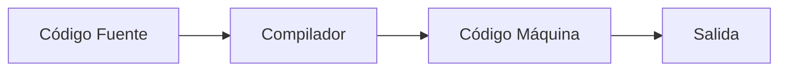
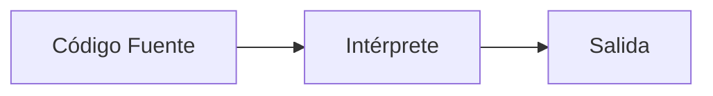
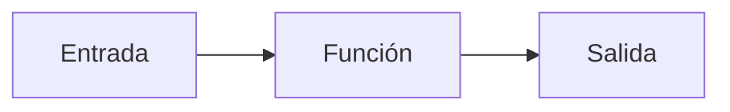

# Universidad C++ Aprende el Lenguaje C++ desde Cero

---

- [Universidad C++ Aprende el Lenguaje C++ desde Cero](#universidad-c-aprende-el-lenguaje-c-desde-cero)
  - [Introducción a C++](#introducción-a-c)
    - [C++ es un Lenguaje Compilado](#c-es-un-lenguaje-compilado)
    - [¿Qué es una función?](#qué-es-una-función)
    - [Hola Mundo en C++](#hola-mundo-en-c)

---

## Introducción a C++

- Lenguaje de propósito general
- Muy utiliza para crear todo tipo de aplicaciones, incluyendo video-juegos
- C++ es una mejora del lenguaje C, al añadir la programación orientada a objetos (POO).
- C++ también es conocido como cpp, ya que la "p" significa "plus" o "+" en inglés
- C++ fue presentado en 1985, y fue creado por Bjarne Stroustrup.

### C++ es un Lenguaje Compilado

- C++ al igual que el lenguaje C, son lenguajes compilados.
- Es decir, necesitamos de un compilador para primero convertir el código fuente a `bytecode` y finalmente poder ejecutar nuestro programa.
- Recordemos que tenemos lenguajes compilados e interpretados.
- Los lenguajes compilados, antes de poder ejecutar el código, primero se compila a `bytecode`.
- En cambio, los lenguajes interpretados van traduciendo y ejecutando el código línea a línea.

**Lenguajes Compilados:**



**Lenguajes Interpretados:**



### ¿Qué es una función?

Una función es un bloque de código que nos permite realizar alguna operación.

**Ejemplo:** Mandar a imprimir algo a consola.



### Hola Mundo en C++

```cpp
#include <iostream> // Libreria para la entrada y salida estandar
// namespace = espacio de nombres
using namespace std; // Usaermos objetos y funciones del namespace

// int -> Tipo de regreso
// main -> nombre  función principal
int main() {
   // Cuerpo de la función principal
   cout << "Hola Mundo en C++"; // cout es objeto que manda a imprimir información a la consola
   // "Hola mundo" --> Cadena de caracteres
   // >> -> Operador de inserción o de salida
   return 0; //-> Si regresa 0, el programa se ejecutó OK
} // Fin función main
```

**🟢 Ejecutar:**

```plaintext
Hola Mundo en C++
```

---
