# Universidad C++ Aprende el Lenguaje C++ desde Cero

---

- [Universidad C++ Aprende el Lenguaje C++ desde Cero](#universidad-c-aprende-el-lenguaje-c-desde-cero)
  - [Introducción a C++](#introducción-a-c)
    - [C++ es un Lenguaje Compilado](#c-es-un-lenguaje-compilado)
    - [¿Qué es una función?](#qué-es-una-función)
    - [Hola Mundo en C++](#hola-mundo-en-c)
  - [Variables en C++](#variables-en-c)
    - [Tipos de Memoria](#tipos-de-memoria)
      - [¿Qué es una variable?](#qué-es-una-variable)
      - [Visualización de la Memoria](#visualización-de-la-memoria)
    - [Tipos de Datos en C++](#tipos-de-datos-en-c)
    - [Ejemplo de Variables en C++](#ejemplo-de-variables-en-c)
    - [Ejemplo de Tipos de Datos en C++](#ejemplo-de-tipos-de-datos-en-c)
    - [Cadena en C++](#cadena-en-c)
    - [Modo Debug en C++](#modo-debug-en-c)
    - [Dirección de Memoria de una Variable en C++](#dirección-de-memoria-de-una-variable-en-c)
    - [Introducir Datos por Consola en C++](#introducir-datos-por-consola-en-c)
    - [Introducir una Cadena en C++](#introducir-una-cadena-en-c)
    - [Ejercicio Propuesto: Tipo de Datos en C++](#ejercicio-propuesto-tipo-de-datos-en-c)
    - [Constantes en C++](#constantes-en-c)
    - [Tamaño en Bytes de los Tipos de Datos en C++](#tamaño-en-bytes-de-los-tipos-de-datos-en-c)
  - [Operadores en C++](#operadores-en-c)
    - [Operadores Aritméticos](#operadores-aritméticos)
    - [Operadores de Incremento/Decremento en C++](#operadores-de-incrementodecremento-en-c)
    - [Ejercicio Operadores de Incremento y Decremento en C++](#ejercicio-operadores-de-incremento-y-decremento-en-c)
    - [Operadores de Asignación en C++](#operadores-de-asignación-en-c)
    - [Operadores de Comparación ó Relacionales en C++](#operadores-de-comparación-ó-relacionales-en-c)
      - [Los operadores de comparación en C++ son](#los-operadores-de-comparación-en-c-son)
    - [Operadores Lógicos en C++](#operadores-lógicos-en-c)
      - [Tabla de Verdad](#tabla-de-verdad)
        - [AND](#and)
        - [OR](#or)
        - [NOT](#not)
    - [Ejercicio Valor dentro de Rango en C++](#ejercicio-valor-dentro-de-rango-en-c)
    - [Ejercicio de Precedencia de Operadores en C++](#ejercicio-de-precedencia-de-operadores-en-c)
  - [Sentencia en C++](#sentencia-en-c)
    - [Sentencia if en C++](#sentencia-if-en-c)
    - [Sentencia if-else en C++](#sentencia-if-else-en-c)
    - [Sentencia if - else if - else en C++](#sentencia-if---else-if---else-en-c)
    - [Operador ternario en C++](#operador-ternario-en-c)
    - [Ejercicio Propuesto: Mayor de Edad](#ejercicio-propuesto-mayor-de-edad)
    - [Ejercicio Día de la Semana en C++](#ejercicio-día-de-la-semana-en-c)
    - [Sentencia switch en C++](#sentencia-switch-en-c)
  - [Ciclos en C++](#ciclos-en-c)
    - [Tipos de Ciclos](#tipos-de-ciclos)
    - [Ciclo `while`](#ciclo-while)
    - [Ciclo `do while`](#ciclo-do-while)
    - [Ejercicio ciclo `do while` en C++](#ejercicio-ciclo-do-while-en-c)
    - [Ciclo `for`](#ciclo-for)
    - [Incremento y Decremento de 3 en 3 con ciclo `for`](#incremento-y-decremento-de-3-en-3-con-ciclo-for)
    - [Ejercicio Suma Acumulativa for en C++](#ejercicio-suma-acumulativa-for-en-c)
    - [Ejercicio Suma Acumulativa while y do-while en C++](#ejercicio-suma-acumulativa-while-y-do-while-en-c)
  - [Apuntadores en C++](#apuntadores-en-c)
    - [Copia de Valores](#copia-de-valores)
    - [Copia de la Referencia de Memoria (Apuntadores)](#copia-de-la-referencia-de-memoria-apuntadores)
    - [Ejercicio de Apuntadores](#ejercicio-de-apuntadores)
    - [Uso de Apuntadores](#uso-de-apuntadores)
  - [Arreglos En C++](#arreglos-en-c)
    - [Uso de Arreglos](#uso-de-arreglos)
    - [Modificación de los valores de un arreglo](#modificación-de-los-valores-de-un-arreglo)
    - [Lectura de los valores de un arreglo](#lectura-de-los-valores-de-un-arreglo)
    - [Ejemplo de Arreglos](#ejemplo-de-arreglos)
    - [Sintaxis Simplificada de Arreglos](#sintaxis-simplificada-de-arreglos)
    - [Iterar los Elementos de un Arreglo](#iterar-los-elementos-de-un-arreglo)
    - [Arreglos y Apuntadores](#arreglos-y-apuntadores)
    - [Introducir Valores a un Arreglo](#introducir-valores-a-un-arreglo)

---

## Introducción a C++

- Lenguaje de propósito general
- Muy utiliza para crear todo tipo de aplicaciones, incluyendo video-juegos
- C++ es una mejora del lenguaje C, al añadir la programación orientada a objetos (POO).
- C++ también es conocido como cpp, ya que la "p" significa "plus" o "+" en inglés
- C++ fue presentado en 1985, y fue creado por Bjarne Stroustrup.

### C++ es un Lenguaje Compilado

- C++ al igual que el lenguaje C, son lenguajes compilados.
- Es decir, necesitamos de un compilador para primero convertir el código fuente a `bytecode` y finalmente poder ejecutar nuestro programa.
- Recordemos que tenemos lenguajes compilados e interpretados.
- Los lenguajes compilados, antes de poder ejecutar el código, primero se compila a `bytecode`.
- En cambio, los lenguajes interpretados van traduciendo y ejecutando el código línea a línea.

**Lenguajes Compilados:**

```mermaid
graph LR
A[Código Fuente] -->B[Compilador] --> C[Código Máquina] --> D[Salida]
```



**Lenguajes Interpretados:**

```mermaid
graph LR
A[Código Fuente] -->B[Intérprete] --> C[Salida]
```



### ¿Qué es una función?

Una función es un bloque de código que nos permite realizar alguna operación.

**Ejemplo:** Mandar a imprimir algo a consola.

```mermaid
graph LR
A[Entrada] -->B[Función] --> C[Salida]
```



### Hola Mundo en C++

```cpp
#include <iostream> // Librería para la entrada y salida estándar
// namespace = espacio de nombres
using namespace std; // Usaremos objetos y funciones del namespace

// int -> Tipo de regreso
// main -> nombre  función principal
int main() {
   // Cuerpo de la función principal
   cout << "Hola Mundo en C++"; // cout es objeto que manda a imprimir información a la consola
   // "Hola mundo" --> Cadena de caracteres
   // >> -> Operador de inserción o de salida
   return 0; //-> Si regresa 0, el programa se ejecutó OK
} // Fin función main
```

**🟢 Ejecutar:**

```plaintext
Hola Mundo en C++
```

---

## Variables en C++

### Tipos de Memoria

**ROM:**
ROM = Read Only Memory
Memoria de Solo Lectura

Los datos almacenados aquí No se pueden modificar

**RAM:**
RAM = Random Access Memory
Memoria de Acceso Aleatorio

Esta memoria es de Lectura y Escritura.
Por lo tanto la usaremos para almacenar nuestros programas (Ej. Variables)

#### ¿Qué es una variable?

Una variable nos permite almacenar los datos de nuestros programas.

**Se compone de varios elementos:**

1. nombre
2. Valor almacenado (tipo de dato)
3. Dirección de memoria

**Ejemplo:** `int miVariable = 10;`

#### Visualización de la Memoria

```cpp
int miVariable = 10; // Un valor tipo int 0 ocupa 4 bytes. -> 0x333 -> Memoria Stack
// ...
// ...
miVariable = 20; // un valor -> 0x334 -> Memoria Stack
```

### Tipos de Datos en C++

| Tipos de Datos | Significado                      | Ejemplo                  |
| -------------- | -------------------------------- | ------------------------ |
| `int`          | Entero                           | 10, -8, etc (4 bytes)    |
| `float`        | Real                             | 3.5, -6.9, etc (4 bytes) |
| `double`       | Real con más precisión que float | 3e39 (8 bytes)           |
| `char`         | Carácter                         | 'A' (1 byte)             |
| `bool`         | Lógico o Booleano                | true o false (1 byte)    |

### Ejemplo de Variables en C++

```cpp
#include <iostream>

using namespace std;

int main() {
  // 1. Declarar variables y asignar un valor
  int entero; // Declaración
  entero = 10; // Inicialización

  float flotante = 7.9;

  // 2. Imprimir las variables
  cout << "Entero: " << entero << endl;
  cout << "Flotante: " << flotante;

  return 0;
}
```

**🟢 Ejecutar:**

```plaintext
Entero: 10
Flotante: 7.9
```

### Ejemplo de Tipos de Datos en C++

```cpp
#include <iostream>
#include <iomanip> // Input-Output-manipulation

using namespace std;

int main()
{
  // Tipos de Datos en C++

  // Tipo entero
  int entero = 10;
  cout << "Entero: " << entero << endl;
  // Tipo flotante
  float flotante = 8.9;
  cout << fixed << setprecision(2);
  cout << "Flotante: " << flotante << endl;
  // Tipo double
  double doble = 9.9999;
  cout << "Doble: " << doble << endl;
// Tipo chair
  char caracter = 'A';
  cout << "Caracter: " << caracter << endl;
  char caracterDecimal = 65; // A -> Ascii
  cout << "Caracter en Decimal: " << caracterDecimal << endl;
  // Tipo bool
  bool booleano = false; // true-1 o false-0
  cout << "Booleano: " << booleano << endl;
  
  return 0;
}
```

**🟢 Ejecutar:**

```plaintext
Entero: 10
Flotante: 8.90
Doble: 10.00
Caracter: A
Caracter en Decimal: A
Booleano: 0
```

### Cadena en C++

```cpp
#include <iostream>
#include <iomanip> // Input-Output-manipulation

using namespace std;

int main()
{
  // Tipos de Datos en C++
  // Clase String
  string cadena = "Hola";
  cout << "Cadena: " << cadena;

  return 0;
}
```

**🟢 Ejecutar:**

```plaintext
Cadena: Hola
```

### Modo Debug en C++

```cpp
#include <iostream>
#include <iomanip> // Input-Output-manipulation

using namespace std;

int main()
{
  // Tipos de Datos en C++

  // Tipo entero
  int entero = 10;
  cout << "Entero: " << entero << endl;
  // Tipo flotante
  float flotante = 8.9;
  cout << fixed << setprecision(2);
  cout << "Flotante: " << flotante << endl;
  // Tipo double
  double doble = 9.9999;
  cout << "Doble: " << doble << endl;
// Tipo chair
  char caracter = 'A';
  cout << "Caracter: " << caracter << endl;
  char caracterDecimal = 65; // A -> ASCII
  cout << "Caracter en Decimal: " << caracterDecimal << endl;
  // Tipo bool
  bool booleano = false; // true-1 o false-0
  cout << "Booleano: " << booleano << endl;

  // Clase String
  string cadena = "Hola";
  cout << "Cadena: " << cadena;
  
  return 0;
}
```

**🟢 Ejecutar:**

```plaintext
Entero: 10
Flotante: 8.90
Doble: 10.00
Caracter: A
Caracter en Decimal: A
Booleano: 0
Cadena: Hola
```

### Dirección de Memoria de una Variable en C++

`int miNumero = 10;` -> 0x333 ... 0x334

Obtener dirección memoria:

`&miNumero`

**Ejemplo:** `cout << "Dir. memoria: " << &miNumero;` --> Imprime 0x333

```cpp
#include <iostream>
#include <iomanip> // Input-Output-manipulation

using namespace std;

int main()
{
  // Dirección Memoria de una variable en C++

  // Tipo entero
  int entero = 10;
  cout << "Entero: " << entero << endl;
  // Dirección memoria de la variable
  cout << "Dir. memoria: " << &entero << endl;
  
  return 0;
}
```

**🟢 Ejecutar:**

```plaintext
Entero: 10
Dir. memoria: 0x821b1ff86c
```

### Introducir Datos por Consola en C++

```cpp
#include <iostream>

using namespace std;

int main()
{
  // Introducir datos desde la consola

  // 1. Declarar variable
  int entero;
  // 2. Solicitar el valor de entrada
  cout << "Proporciona un numero: ";
  cin >> entero;
  // 3. Desplegamos el valor
  cout << "Valor proporcionado: " << entero;

  return 0;
}
```

**🟢 Ejecutar:**

```plaintext
Proporciona un numero: 20
Valor proporcionado: 20
```

### Introducir una Cadena en C++

```cpp
#include <iostream>

using namespace std;

int main()
{
  // Introducir cadenas desde la consola

  // 1. Declarar variable
  string nombre;
  // 2. Solicitar el valor de entrada
  cout << "Proporciona tu nombre: ";
  // cin >> nombre; // No lee la linea completa,
  // sino hasta un espacio
  cin.ignore(); // Limpiar caracteres del buffer de la consola
  getline(cin, nombre);
  // 3. Desplegamos el valor
  cout << "Nombre proporcionado: " << nombre;

  return 0;
}
```

**🟢 Ejecutar:**

```plaintext
Proporciona tu nombre: Zolyn UX
Nombre proporcionado: Zolyn UX
```

### Ejercicio Propuesto: Tipo de Datos en C++

```cpp
#include <iostream>
#include <iomanip>

using namespace std;

int main()
{
  // Solución Ejercicio Tipos de Datos
  string nombreCompleto;
  int edad;
  float sueldo;
  bool empleadoConfianza;
  // Lee la información de la consola
  cout << "Proporciona tu nombre: ";
  getline(cin, nombreCompleto);
  cout << "Proporciona tu edad: ";
  cin >> edad;
  cout << "Proporciona tu sueldo (USD): ";
  cin >> sueldo;
  cout << "Eres empleado de confianza (1-true/0-false)?" << endl;
  cin >> empleadoConfianza;
  // Imprimir la informacion
  cout << endl;
  cout << "La informacion proporcionada es:" << endl;
  cout << "Nombre: " << nombreCompleto << endl;
  cout << "Edad: " << edad << endl;
  cout << fixed << setprecision(2);
  cout << "Sueldo: " << sueldo << endl;
  cout << "Empleado de confianza: " << empleadoConfianza << endl;
  return 0;
}
```

**🟢 Ejecutar:**

```plaintext
Proporciona tu nombre: David UX
Proporciona tu edad: 32
Proporciona tu sueldo (USD): 450.3
Eres empleado de confianza (1-true/0-false)?
1

La informacion proporcionada es:
Nombre: David UX
Edad: 32
Sueldo: 450.3
Empleado de confianza: 1
```

### Constantes en C++

`const <tipo> <nombre> = valor;`

**Ejemplo:** `const int MI_CONSTANTE = 100;`

Una vez definido el valor de una constante, ya que no podemos modificarlo.

```cpp
#include <iostream>
#include <cmath>
// Use math defines
// #define _USE_MATH_DEFINES

using namespace std;

int main()
{
  // Definir constantes en C++
  const int MI_CONSTANTE = 100;
  // MI_CONSTANTE = 20; // read-only o de solo lectura.

  const float PI = 3.1416;
  cout << "Mi constante: " << MI_CONSTANTE << endl;
  cout << "Constante PI: " << PI << endl;
  cout << "Constante Matematica PI: " << M_PI << endl;

  return 0;
}
```

**🟢 Ejecutar:**

```plaintext
Mi constante: 100
Constante PI: 3.1416
Constante Matematica PI: 3.14159
```

### Tamaño en Bytes de los Tipos de Datos en C++

```cpp
#include <iostream>

using namespace std;

int main()
{
  // Obtener el tamanio en bytes de cada tipo de dato
  int entero;
  float flotante;
  double doble;
  char caracter;
  bool booleano;
  string cadena = "Hola Mundo";
  // Imprimir cada variable (tamanio en bytes)
  cout << "int tamanio bytes: " << sizeof(entero) << endl;
  cout << "float tamanio bytes: " << sizeof(flotante) << endl;
  cout << "double tamanio bytes: " << sizeof(doble) << endl;
  cout << "char tamanio bytes: " << sizeof(caracter) << endl;
  cout << "bool tamanio bytes: " << sizeof(booleano) << endl;
  cout << "cadena tamanio length: " << cadena.length() << endl;
  cout << "cadena tamanio size: " << cadena.size() << endl;

  return 0;
}
```

**🟢 Ejecutar:**

```plaintext
int tamanio bytes: 4
float tamanio bytes: 4
double tamanio bytes: 8
char tamanio bytes: 1
bool tamanio bytes: 1
cadena tamanio length: 10
cadena tamanio size: 10
```

---

## Operadores en C++

Los operadores nos permiten realizar operaciones al usar valores y variables.

**Tipos de Operadores:**

- Aritméticos
- Asignación
- Comparación
- Lógicos

### Operadores Aritméticos

| Operadores | Significado               | Ejemplos  |
| ---------- | ------------------------- | --------- |
| +          | Suma                      | x + y     |
| -          | Resta                     | x - y     |
| *          | Multiplicación            | x * y     |
| /          | División                  | x / y     |
| %          | Modulo (Residua División) | x % y     |
| ++         | Incremento                | ++x o x++ |
| --         | Decremento                | --x o x-- |

---

```cpp
#include <iostream>
using namespace std;

int main()
{
  // Operadores aritmeticos
  int a, b, c, f;
  float d;

  // suma +
  a = 3 + 4;
  cout << "Suma: " << a << endl;
  // Resta -
  b = 6 - 2;
  cout << "Resta: " << b << endl;
  // Multiplicacion *
  c = a * 2;
  cout << "Multiplicacion: " << c << endl;
  // Division
  d = b / 2.5;
  cout << "Division: " << d << endl;
  // Modulo (residuo division)
  f = 9 % 2;
  cout << "Modulo: " << f << endl;

  return 0;
}
```

**🟢 Ejecutar:**

```plaintext
Suma: 7
Resta: 4
Multiplicacion: 14
Division: 1.6
Modulo: 1
```

### Operadores de Incremento/Decremento en C++

```cpp
#include <iostream>
using namespace std;

int main()
{
  // Operadores Incremento
  int a = 0, b, c;
  // Operador Pre-Incremento
  ++a; // Se incrementa antes de ser utilizada nuevamente.
  cout << "Nuevo valor a (++a): " << a << endl;
  // Operador Post-Incremento
  a++; // Se incrementa hasta la siguiente vez que se utilice
  cout << "Nuevo valor a (a++): " << a << endl;

  // Operadores Decremento
  // Operador Pre-Decremento
  --a; // Se decrementa antes de ser utilizada nuevamente.
  cout << "Nuevo valor a (--a): " << a << endl;
  // Operador Post-Decremento
  a--; // Se decrementa hasta la siguiente vez que se utilice
  cout << "Nuevo valor a (a--): " << a << endl;

  return 0;
}
```

**🟢 Ejecutar:**

```plaintext
Nuevo valor a (++a): 1
Nuevo valor a (a++): 2
Nuevo valor a (--a): 1
Nuevo valor a (a--): 0
```

### Ejercicio Operadores de Incremento y Decremento en C++

```cpp
#include <iostream>
using namespace std;

int main()
{
  // Ejercicio Incremento / Decremento
  int a = 5, b = 2, c;
  c = ++a * b++;
  cout << "Valor a: " << a << endl;
  cout << "Valor b: " << b << endl;
  cout << "Valor c: " << c << endl;

  c = --a * b--;
  cout << endl;
  cout << "Valor a: " << a << endl;
  cout << "Valor b: " << b << endl;
  cout << "Valor c: " << c << endl;
  return 0;
}
```

**🟢 Ejecutar:**

```plaintext
Valor a: 6
Valor b: 3
Valor c: 12

Valor a: 5
Valor b: 2
Valor c: 15
```

### Operadores de Asignación en C++

| Operadores | Significado                  | Ejemplos |
| ---------- | ---------------------------- | -------- |
| =          | Asignación                   | x = 5    |
| +=         | Asignación Compuesto de Suma | x += 3   |

Tambien existen operadores compuestos de:

`+=`,`-=`,`*=`,`/=`,`%=`, entre varios más.

```cpp
#include <iostream>
using namespace std;

int main()
{

  // Operadores de Asignacioon
  // Operador = Para asignar un valor
  int miNum = 10;
  cout << "Valor miNum: " << miNum << endl;
  miNum = 20;
  cout << "Valor miNum: " << miNum << endl;

  // Operadores de asignacion compuesto
  // compuesto suma +=
  miNum += 5; // miNum = miNum + 5;
  cout << "Valor miNum: " << miNum << endl;
  // compuesto resta -=
  miNum -= 3; // miNum = miNum - 3;
  cout << "Valor miNum: " << miNum << endl;
  // compuesto Multiplicacion *=
  miNum *= 2; // miNum = miNum * 2;
  cout << "Valor miNum: " << miNum << endl;
  // compuesto division /=
  miNum /= 7; // miNum = miNum / 7;
  cout << "Valor miNum: " << miNum << endl;
  // compuesto modulo %=
  miNum %= 2; // miNum = miNum % 2;
  cout << "Valor miNum: " << miNum << endl;

  return 0;
}
```

**🟢 Ejecutar:**

```plaintext
Valor miNum: 10
Valor miNum: 20
Valor miNum: 25
Valor miNum: 22
Valor miNum: 44
Valor miNum: 6
Valor miNum: 0
```

### Operadores de Comparación ó Relacionales en C++

Son operadores que comparan dos variables o expresiones, y el resultado es una expresión booleana que puede ser verdadera (true) o falsa (false).

#### Los operadores de comparación en C++ son

| Operador | Significado       | Ejemplo |
| -------- | ----------------- | ------- |
| >        | Mayor que         | a > b   |
| >=       | Mayor o igual que | a >= b  |
| <        | Menor que         | a < b   |
| <=       | Menor o igual que | a <= b  |
| ==       | igual que         | a == b  |
| !=       | Distinto que      | a != b  |

```cpp
#include <iostream>
using namespace std;

int main()
{
  // Operadores Comparación o Relacionales
  int a = 5, b = 6;
  cout << "Valor a: " << a << endl;
  cout << "Valor b: " << b << endl;
  // Operador Igualdad ==
  bool c = a == b;
  cout << " a igual que b?: " << c << endl;

  // Operador Distinto !=
  c = a != b;
  cout << " a distinto que b?: " << c << endl;

  // Operador Mayor que
  c = a > b;
  cout << " a Mayor que b?: " << c << endl;

  // Operador Mayor o igualdad que
  c = a >= b;
  cout << " a Mayor o igual que b?: " << c << endl;

  // Operador Menor que
  c = a < b;
  cout << " a Menor que b?: " << c << endl;

  // Operador menor o igual que
  c = a <= b;
  cout << " a Menor o Igual que b?: " << c << endl;

  return 0;
}
```

**🟢 Ejecutar:**

```plaintext
Valor a: 5
Valor b: 6
 a igual que b?: 0
 a distinto que b?: 1
 a Mayor que b?: 0
 a Mayor o igual que b?: 0
 a Menor que b?: 1
 a Menor o Igual que b?: 1
```

### Operadores Lógicos en C++

Los operadores lógicos se utilizan para realizar operaciones booleanas. Los principales operadores lógicos son:

| Operador     | Nombre     | Ejemplo                 | Resultado |
| ------------ | ---------- | ----------------------- | --------- |
| `&&`         | AND Lógico | `true && false`         | `false`   |
| &#124;&#124; | OR Lógico  | true &#124;&#124; false | `true`    |
| `!`          | NOT Lógico | `!true`                 | `false`   |

#### Tabla de Verdad

Muestra el comportamiento de los operadores lógicos:

##### AND

Regresa verdadero si ambos valores lógicos son verdaderos

| A     | B     | A && B |
| ----- | ----- | ------ |
| true  | true  | true   |
| true  | false | false  |
| false | true  | false  |
| false | false | false  |

##### OR

Regresa verdadero si cualquiera de los operadores es verdadero

| A     | B     | A &#124;&#124; B |
| ----- | ----- | ---------------- |
| true  | true  | true             |
| true  | false | true             |
| false | true  | true             |
| false | false | false            |

##### NOT

Inverte el resultado lógico true -> false o false -> true

| A     | !A    |
| ----- | ----- |
| true  | false |
| false | true  |

---

```cpp
#include <iostream>
using namespace std;

int main()
{
  // Operadores Logicos

  bool a = true, b = false, c;
  cout << "Valor a: " << a << endl;
  cout << "Valor b: " << b << endl;
  // Operador and (&&)
  // Regresa verdadero si ambos operandos son verdaderos
  c = a && b;
  cout << "Resultado operador and: " << c << endl;

  // Operador or (||)
  // Regresa verdadero si cualquiera de los operandos es verdadero
  c = a || b;
  cout << "Resultado operador or: " << c << endl;

  // Operador not (!)
  // Invierte el valor original (true -> false, false -> true)
  c = !a;
  cout << "Resultado operador not: " << c << endl;

  return 0;
}
```

**🟢 Ejecutar:**

```plaintext
Valor a: 1
Valor b: 0
Resultado operador and: 0
Resultado operador or: 1
Resultado operador not: 0
```

### Ejercicio Valor dentro de Rango en C++

```cpp
#include <iostream>
using namespace std;

int main()
{
  // Validar si un valor esta dentro de rango

  const int MINIMO = 0, MAXIMO = 5;
  // Solicitar un valor entre 0 y 5
  int dato;
  cout << "Proporciona una dato entre 0 y 5: ";
  cin >> dato;
  // Verificar si el dato esta dentro de rango
  bool dentroRango = dato >= MINIMO && dato <= MAXIMO;
  cout << "Valor dentro de rango?: " << dentroRango << endl;

  return 0;
}
```

**🟢 Ejecutar:**

```plaintext
Proporciona una dato entre 0 y 5: 2
Valor dentro de rango?: 1
```

### Ejercicio de Precedencia de Operadores en C++

```cpp
#include <iostream>
using namespace std;

int main()
{
  // Precedencia de Operadores en C
  // 1. Parentesis y Corchetes
  // 2. Operadores unarios, como -, ++, --, !
  // 3. Aritmeticos *, / y %
  // 4. Aritmeticos + y -
  // 5. Relacionales <, <=, > y >=
  // 6. Igualdad/distinto == y !=
  // 7. Logicos && y ||
  // 8. Asignacion =, +=, -=, *=, etc.

  // Ejemplo: Se revisa de izquierda a derecha
  // int a = 12 / (3 + 2) * 3 - 1;
  int a = 12 / 3 + 2 * 3 - 1;
  cout << "Resultado: " << a << endl;

  return 0;
}
```

**🟢 Ejecutar:**

```plaintext
Resultado: 9
```

---

## Sentencia en C++

### Sentencia if en C++

```cpp
if(condicion_booleana) {
  // instrucciones  ...
}
```

**Diagrama Flujo:**


```cpp
#include <iostream>
using namespace std;

int main()
{
  // Sentencia if
  // Revisa si el valor proporcionado es positivo

  int numero = 10;

  // Verificar si es positivo
  if (numero > 0)
  {
    cout << "Valor positivo: " << numero << endl;
  }

  return 0;
}
```

**🟢 Ejecutar:**

```plaintext
Valor positivo: 10
```

### Sentencia if-else en C++

**Sintáxis:**

```cpp
if (condicion) {
  // instrucciones..
} else {
  // instrucciones..
}
```

**Diagrama Flujo:**


```cpp
#include <iostream>
using namespace std;

int main()
{
  // Sentencia if else
  // Revisa si el valor proporcionado es positivo

  int numero = 10;

  // Verificar si es positivo
  if (numero > 0)
  {
    cout << "Valor positivo: " << numero << endl;
  }
  else
  {
    cout << "Valor Cero o Negativo: " << numero << endl;
  }

  return 0;
}
```

**🟢 Ejecutar:**

```plaintext
Valor positivo: 10
```

### Sentencia if - else if - else en C++

```cpp
if (condicion) {
  // instrucciones..
} else if (nueva condicion) {
  // instrucciones..
} else {
  // instrucciones..
}
```

```cpp
#include <iostream>
using namespace std;

int main()
{
  // Sentencia if else
  // Revisa si el valor proporcionado es positivo

  int numero = 10;

  // Verificar si es positivo
  if (numero > 0)
  {
    cout << "Valor positivo: " << numero << endl;
  }
  else if (numero < 0)
  {
    cout << "Valor Negativo: " << numero << endl;
  }
  else
  {
    cout << "Valor Cero: " << numero << endl;
  }

  return 0;
}
```

**🟢 Ejecutar:**

```plaintext
Valor positivo: 10
```

### Operador ternario en C++

Es una simplificación de la sentencia
if/else.

**Sintaxis:**

```cpp
if (condicion) {
  // instrucciones..
} else {
  // instrucciones..
}
```

**Sintaxis Operador Ternario:**

```cpp
(condicion) ? caso verdadero : caso falso;
```

```cpp
#include <iostream>
using namespace std;

int main()
{
  // Sentencia if else
  // Revisa si el valor proporcionado es positivo

  int numero = 10;

  // Verificar con operador ternario
  cout << "Valor ";
  (numero > 0) ? cout << "Positivo" : cout << "Cero o Negativo";
  cout << ": " << numero << endl;

  return 0;
}
```

**🟢 Ejecutar:**

```plaintext
Valor Positivo: 10
```

### Ejercicio Propuesto: Mayor de Edad

```cpp
#include <iostream>
using namespace std;

int main()
{
  // Mayor de edad
  int edad;
  bool MAYOR = edad >= 18;
  cout << "Proporciona tu edad: ";
  cin >> edad;

  if (MAYOR)
    cout << "La persona con edad " << edad << " es un adulto" << endl;
  else if ((!MAYOR) && edad > 0)
    cout << "La persona con edad " << edad << " es un menor de edad" << endl;
  else
    cout << "Ingresaste es invalido" << endl;

  return 0;
}
```

**🟢 Ejecutar:**

```plaintext
Proporciona tu edad: -2
Ingresaste es invalido
```

### Ejercicio Día de la Semana en C++

```cpp
#include <iostream>
using namespace std;

int main()
{
  // Mayor de edad
  int diaSemana;
  cout << "Proporciona un numero de dia de la semana: ";
  cin >> diaSemana;

  if (diaSemana == 1)
    cout << "Lunes" << endl;
  else if (diaSemana == 2)
    cout << "Martes" << endl;
  else if (diaSemana == 3)
    cout << "Miercoles" << endl;
  else if (diaSemana == 4)
    cout << "Jueves" << endl;
  else if (diaSemana == 5)
    cout << "Viernes" << endl;
  else if (diaSemana == 6)
    cout << "Sabado" << endl;
  else if (diaSemana == 7)
    cout << "Domingo" << endl;
  else
    cout << "Ingresaste es invalido" << endl;

  return 0;
}
```

**🟢 Ejecutar:**

```plaintext
Proporciona un numero de dia de la semana: 5
Viernes
```

### Sentencia switch en C++

**Sintaxis if-else:**

```cpp
if (condicion1) {
  // instrucciones..
} else if (condicion2) {
  // instrucciones..
} else if (condicion3) {
  // instrucciones..
} else {
  // instrucciones..
}
```

**Sintaxis switch:**

```cpp
switch(valor_a_evaluar) {
  case 1:
    // instrucciones..
    break;
  case 2:
    // instrucciones..
    break;
  case 3:
    // instrucciones..
    break;
  default:
    // invierte las instrucciones..
}
```

```cpp
#include <iostream>
using namespace std;

int main()
{
  // Mayor de edad
  int diaSemana;
  cout << "Proporciona un numero de dia de la semana: ";
  cin >> diaSemana;

  switch (diaSemana)
  {
  case 1:
    cout << "Lunes" << endl;
    break;
  case 2:
    cout << "Martes" << endl;
    break;
  case 3:
    cout << "Miercoles" << endl;
    break;
  case 4:
    cout << "Jueves" << endl;
    break;
  case 5:
    cout << "Viernes" << endl;
    break;
  case 6:
    cout << "Sabado" << endl;
    break;
  case 7:
    cout << "Domingo" << endl;
    break;
  default:
    cout << "Ingresaste es invalido" << endl;
  }
  return 0;
}
```

**🟢 Ejecutar:**

```plaintext
Proporciona un numero de dia de la semana: 5
Viernes
```

## Ciclos en C++

Un ciclo nos permite repetir un bloque de código mientras la condición sea verdadera.

### Tipos de Ciclos

- Ciclo `while`
- Ciclo `do while`
- Ciclo `for`

### Ciclo `while`

**Sintaxis:**

```cpp
while(condicion) {
  // Instrucciones...
}
```

- La condición es una valor lógico (`true`/`false`).
- El ciclo `while` repite la ejecución del bloque de código mientras la condición sea verdadera (`true`).

```cpp
#include <iostream>
using namespace std;

int main()
{
  // Ciclo while
  // Imprimir 1 al 5
  int contado = 1, maximo = 5;
  while (contado <= maximo)
  {
    cout << contado++ << endl;
  }

  return 0;
}
```

**🟢 Ejecutar:**

```plaintext
1
2
3
4
5
```

### Ciclo `do while`

**Sintaxis:**

```cpp
do {
  // Instrucciones...
} while(condicion);
```

- El ciclo `do while` ejecuta al menor una vez su bloque de código debido a que la condición a revisar sse encuentra al final del bloque.

```cpp
#include <iostream>
using namespace std;

int main()
{
  // Ciclo do while
  // Solicitamos un valor positivo
  int numero;
  do
  {
    cout << "Proporciona un valor positivo: ";
    cin >> numero;
  } while (numero <= 0);
  cout << "Valor positivo: " << numero << endl;

  return 0;
}
```

**🟢 Ejecutar:**

```plaintext
Proporciona un valor positivo: -1
Proporciona un valor positivo: 0
Proporciona un valor positivo: 5
Valor positivo: 5
```

### Ejercicio ciclo `do while` en C++

```cpp
#include <iostream>
using namespace std;

int main()
{
  // Ciclo do while
  // Imprimir 1 al 5
  int contado = 1, maximo = 5;
  do
  {
    cout << contado++ << endl;
  } while (contado <= maximo);

  return 0;
}
```

**🟢 Ejecutar:**

```plaintext
1
2
3
4
5
```

### Ciclo `for`

- Con ciclo `for` especificamos cuantas veces queremos repetir su bloque de código.

**Sintaxis:**

```cpp
for (/*(1). declaracion variables*/;/* (2). condicion evaluar*/;/*(4). incremeto o decremento*/){
  // (3). Instrucciones...
}
```

1. Se ejecuta solo una vez al inicio de la ejecución del ciclo `for`.
2. Se repite el ciclo mientras la condición sea verdadera.
3. Se ejecuta el bloque de código.
4. Se incremento o decremento los contadores

Se repiten los pasos 2, 3 y 4 mientras la condición sea verdadera.

```cpp
#include <iostream>
using namespace std;

int main()
{
  // Ciclo for
  // Imprimir 1 al 5
  int maximo = 5;
  for (int contador = 1; contador <= maximo; contador++)
  {
    cout << contador << endl;
  }

  return 0;
}
```

**🟢 Ejecutar:**

```plaintext
1
2
3
4
5
```

### Incremento y Decremento de 3 en 3 con ciclo `for`

```cpp
#include <iostream>
using namespace std;

int main()
{
  // Ciclo for
  // Incremento y Decremento de 3 en 3 con ciclo for
  cout << "Incremento de 3 en 3 (tope 10):" << endl;
  for (int i = 1; i <= 10; i += 3)
  {
    cout << i << " ";
  }
  cout << endl;

  cout << "Decremento de 3 en 3 (tope -10):" << endl;
  for (int i = 1; i >= -10; i -= 3)
  {
    cout << i << " ";
  }
  cout << endl;

  return 0;
}
```

**🟢 Ejecutar:**

```plaintext
Incremento de 3 en 3 (tope 10):
1 4 7 10
Decremento de 3 en 3 (tope -10):
1 -2 -5 -8
```

### Ejercicio Suma Acumulativa for en C++

Realizar la suma de los primeros 5 números utilizando un ciclo `for`:

**Ejemplo:**
1 + 2 + 3 + 4 + 5 = 15
  3   +   7   + 5
      10      + 5
          15

```cpp
#include <iostream>
using namespace std;

int main()
{
  // Ciclo for
  // Suma Acumulativa
  int contador = 0;
  cout << "Suma Acumulativa:" << endl;
  for (int i = 1; i <= 5; i++)
  {
    contador += i;
    cout << i;
    (contador == 15) ? cout << " = " << contador : cout << " + ";
  }

  return 0;
}
```

**🟢 Ejecutar:**

```plaintext
Suma Acumulativa:
1 + 2 + 3 + 4 + 5 = 15
```

### Ejercicio Suma Acumulativa while y do-while en C++

```cpp
#include <iostream>
using namespace std;

int main()
{
  // Ciclo while
  // Suma Acumulativa
  int contador = 0, i = 0;
  cout << "Usa 'while'" << endl;
  cout << "Suma Acumulativa:" << endl;
  while (i <= 5)
  {
    contador += i;
    cout << i;
    (contador == 15) ? cout << " = " << contador : cout << " + ";
    i++;
  }

  cout << endl
       << "Usa 'do while'" << endl;
  // Ciclo do while
  // Suma Acumulativa
  contador = 0, i = 0;
  cout << "Suma Acumulativa:" << endl;
  do
  {
    contador += i;
    cout << i;
    (contador == 15) ? cout << " = " << contador : cout << " + ";
    i++;
  } while (i <= 5);

  return 0;
}
```

**🟢 Ejecutar:**

```plaintext
Usa 'while'
Suma Acumulativa:
0 + 1 + 2 + 3 + 4 + 5 = 15
Usa 'do while'
Suma Acumulativa:
0 + 1 + 2 + 3 + 4 + 5 = 15
```

## Apuntadores en C++

Un puntero es una variable que almacena la dirección de memoria de un objeto.

### Copia de Valores

```cpp
// Definimos variables
int a = 10; // paso 1
int b = a; // paso 2
b = 20; // paso 3
```

**En memoria:**

| Paso | Variable | Valor     | Memoria Stack | Significado                                       |
| ---- | -------- | --------- | ------------- | ------------------------------------------------- |
| 1    | a        | 10        | 0x333         | Crea una variable 'a' al valor 10                 |
| 2    | b        | a=10      | 0x333         | Se copia el valor de 'a' a la variable 'b'        |
| 3    | b        | ~~10~~ 20 | 0x444         | Sólo se modifica el valor de 'b', no afecta a 'a' |

### Copia de la Referencia de Memoria (Apuntadores)

```cpp
// variables
int a = 10; // Paso 1
int *b = &a; // Paso 2

cout << a; // Imprime -> 10
cout << *b; // Imprime -> 10
cout << b; // Imprime -> 0x333
// Modificamos el valor de la variable
*b = 20; // Paso 3
cout << a; // Imprime -> 20
cout << *b; // Imprime -> 20
```


| Paso | Variable | Valor     | Memoria Stack | Significado                                                                       |
| ---- | -------- | --------- | ------------- | --------------------------------------------------------------------------------- |
| 1    | a        | 10        | 0x333         | Crea una variable 'a' del valor 10                                                |
| 2    | *b       | &a        | 0x333         | Un cambio en la dirección de memoria a 'a', 'b' es un apuntador a la variable 'a' |
| 3    | *b       | ~~10~~ 20 | 0x444         | Sólo se modifica el valor de 'b', si afecta a 'a'                                 |

### Ejercicio de Apuntadores

```cpp
#include <iostream>
using namespace std;

int main()
{
  // Apuntadores (referencia de memoria)
  int a = 10;
  // Definimos un apuntador
  int *b = &a;
  // Imprimir la direccion de memoria
  cout << "Direccion memoria '&a': " << &a << endl;
  cout << "Direccion memoria a la que apunta 'b': " << b << endl;
  cout << "Desreferencia '*b': " << *b << endl;
  cout << "Valor 'a': " << a << endl;
  cout << "Direccion memoria del apuntador '&b': " << &b << endl;

  return 0;
}
```

**🟢 Ejecutar:**

```plaintext
Direccion memoria '&a': 0x6f56c
Direccion memoria a la que apunta 'b': 0x6f56c
Desreferencia '*b': 10
Valor 'a': 10
Direccion memoria del apuntador '&b': 0x6f560
```

### Uso de Apuntadores

```cpp
#include <iostream>
using namespace std;

int main()
{
  // Apuntadores (referencia de memoria)
  int a = 10;
  // Definimos un apuntador
  int *b = &a;

  // Modificar el valor de 'a', pero con el uso del apuntador
  // Desreferencia para acceder al valor de la memoria a la que apuntamos
  *b = 20;
  cout << "Nuevo valor desde 'a': " << a << endl;
  cout << "Nuevo valor apuntador desde '*b': " << *b << endl;

  return 0;
}
```

**🟢 Ejecutar:**

```plaintext
Nuevo valor desde 'a': 20
Nuevo valor apuntador desde '*b': 20
```

## Arreglos En C++

Un arreglo nos permite almacenar múltiples valores en una sola variable, en lugar de definir varias variables.

### Uso de Arreglos

**Sintaxis:**

`<tipo_dato> <nombre_arreglo>[tamañoArreglo (valor opcional)];`

**Ejemplo:** `int numerosArreglo[5];`

En memoria se crea un arreglo:


### Modificación de los valores de un arreglo

```cpp
int numerosArreglo[5];
// Modificacion valores
numerosArreglo[0] = 10; // Indice: 0, valor: 10
numerosArreglo[4] = 50; // Indice: 4, valor: 50
```

| 0   | 1   | 2   | 3   | 4   |
| --- | --- | --- | --- | --- |
| 10  | ?   | ?   | ?   | 50  |

No es necesario modificar todos los valores del arreglo

### Lectura de los valores de un arreglo

```cpp
int numerosArreglo[5];
// Modificamos algunos valores
numerosArreglo[0] = 10; // Indice: 0, valor: 10
numerosArreglo[4] = 50; // Indice: 4, valor: 50
// Leemos los valores del arreglo
cout << numberosArreglo[0]; // -> Imprime: 10
cout << numberosArreglo[1]; // -> Imprime: ? (valor basura)
cout << numberosArreglo[4]; // -> Imprime: 50
```

| 0   | 1   | 2   | 3   | 4   |
| --- | --- | --- | --- | --- |
| 10  | ?   | ?   | ?   | 50  |

No es necesario modificar todos los valores del arreglo

### Ejemplo de Arreglos

```cpp
#include <iostream>
using namespace std;

int main()
{
  // Arreglos
  // 1. Declarar
  int numerosArreglo[5];
  // 2. Modificar los elementos de un arreglo
  numerosArreglo[0] = 13;
  numerosArreglo[1] = 21;
  numerosArreglo[4] = 82;

  // 3. Imprimir los valores de arreglo

  cout << "Elemento 1 - arrelo[0]: " << numerosArreglo[0] << endl;
  cout << "Elemento 2 - arrelo[1]: " << numerosArreglo[1] << endl;
  cout << "Elemento 3 - arrelo[2]: " << numerosArreglo[2] << endl;
  cout << "Elemento 4 - arrelo[3]: " << numerosArreglo[3] << endl;
  cout << "Elemento 5 - arrelo[4]: " << numerosArreglo[4] << endl;

  return 0;
}
```

**🟢 Ejecutar:**

```plaintext
Elemento 1 - arrelo[0]: 13
Elemento 2 - arrelo[1]: 21
Elemento 3 - arrelo[2]: 145
Elemento 4 - arrelo[3]: 0
Elemento 5 - arrelo[4]: 82
```

### Sintaxis Simplificada de Arreglos

```cpp
//              Posición  0   1   2   3   4
int numerosArreglos[] = {100,200,300,400,500};
// [] -> No se especifica la cantidad de elementos
```

**En  memoria:**

| **Indice:** | 0   | 1   | 2   | 3   | 4   |
| ----------- | --- | --- | --- | --- | --- |
| **Valor:**  | 100 | 200 | 300 | 400 | 500 |

```cpp
#include <iostream>
using namespace std;

int main()
{
  // Arreglos
  // 1. Declarar
  int numerosArreglo[] = {100, 200, 300, 400, 500};

  // 2. Imprimir los valores de arreglo

  cout << "Elemento 1 - arrelo[0]: " << numerosArreglo[0] << endl;
  cout << "Elemento 2 - arrelo[1]: " << numerosArreglo[1] << endl;
  cout << "Elemento 3 - arrelo[2]: " << numerosArreglo[2] << endl;
  cout << "Elemento 4 - arrelo[3]: " << numerosArreglo[3] << endl;
  cout << "Elemento 5 - arrelo[4]: " << numerosArreglo[4] << endl;

  return 0;
}
```

**🟢 Ejecutar:**

```plaintext
Elemento 1 - arrelo[0]: 100
Elemento 2 - arrelo[1]: 200
Elemento 3 - arrelo[2]: 300
Elemento 4 - arrelo[3]: 400
Elemento 5 - arrelo[4]: 500
```

### Iterar los Elementos de un Arreglo

```cpp
#include <iostream>
using namespace std;

int main()
{
  // Arreglos
  // 1. Sintaxis simplificada arreglos
  int numeros[] = {100, 200, 300, 400, 500};

  int elementosArreglo = sizeof(numeros);
  int unElementoArreglo = sizeof(numeros[0]);
  int largoArreglo = elementosArreglo / unElementoArreglo;

  cout << "Cantidad de bytes del arreglo: " << elementosArreglo << endl;
  cout << "Cantidad de bytes de un elemento: " << unElementoArreglo << endl;
  cout << "Cantidad de elementos arreglo: " << largoArreglo << endl;

  cout << "Iteramos el arreglo:" << endl;
  for (int i = 0; i < largoArreglo; i++)
  {
    cout << "Elemento " << i + 1 << " - arrelo[" << i << "]: " << numeros[i] << endl;
  }

  return 0;
}
```

**🟢 Ejecutar:**

```plaintext
Cantidad de bytes del arreglo: 20
Cantidad de bytes de un elemento: 4
Cantidad de elementos arreglo: 5
Iteramos el arreglo:
Elemento 1 - arrelo[0]: 100
Elemento 2 - arrelo[1]: 200
Elemento 3 - arrelo[2]: 300
Elemento 4 - arrelo[3]: 400
Elemento 5 - arrelo[4]: 500
```

### Arreglos y Apuntadores

```cpp
#include <iostream>
using namespace std;

int main()
{
  // Arreglos
  // 1. Sintaxis definir arreglos con apuntadores
  int largoArreglo = 5;
  // int numeros[largoArreglo];
  // Apuntadores
  int *numeros = new int[largoArreglo];

  // Inicializamos los valores
  numeros[0] = 100;
  numeros[1] = 200;
  numeros[2] = 300;
  numeros[3] = 400;
  numeros[4] = 500;

  // Accedemos a los elementos con iterador

  for (int i = 0; i < largoArreglo; i++)
  {
    cout << "elemento " << i + 1 << " - arreglo[" << i << "] = " << numeros[i] << endl;
  }

  // Eliminar el arreglo de la memoria
  delete[] numeros;

  cout << "Eliminar un arreglo de la memoria: " << numeros << endl;

  return 0;
}
```

**🟢 Ejecutar:**

```plaintext
elemento 1 - arreglo[0] = 100
elemento 2 - arreglo[1] = 200
elemento 3 - arreglo[2] = 300
elemento 4 - arreglo[3] = 400
elemento 5 - arreglo[4] = 500
Eliminar un arreglo de la memoria: 0x172
```

### Introducir Valores a un Arreglo

```cpp
#include <iostream>
using namespace std;

int main()
{
  // Introducir valores a un arreglo

  // Declara arreglo
  cout << "Proporciona el largo de arreglo: ";
  int largoArreglo;
  cin >> largoArreglo;

  // Sintaxis apuntadores-arreglo
  int *numeros = new int[largoArreglo];

  // Solicitar los elementos al usuario
  for (int i = 0; i < largoArreglo; i++)
  {
    cout << "Proporciona el valor [" << i << "]" << ": ";
    cin >> numeros[i];
  }

  // Imprimimos los valores del arreglo
  cout << endl
       << "Mostramos los valores almacenados: " << endl;
  for (int i = 0; i < largoArreglo; i++)
  {
    cout << "Elemento[" << i << "]" << " = " << numeros[i] << endl;
  }

  // Eliminar el arreglo de la memoria
  delete[] numeros;

  return 0;
}
```

**🟢 Ejecutar:**

```plaintext
Proporciona el largo de arreglo: 4
Proporciona el valor [0]: 100
Proporciona el valor [1]: 200
Proporciona el valor [2]: 300
Proporciona el valor [3]: 400

Mostramos los valores almacenados:
Elemento[0] = 100
Elemento[1] = 200
Elemento[2] = 300
Elemento[3] = 400
```