# Universidad C++ Aprende el Lenguaje C++ desde Cero

---

- [Universidad C++ Aprende el Lenguaje C++ desde Cero](#universidad-c-aprende-el-lenguaje-c-desde-cero)
  - [Introducción a C++](#introducción-a-c)
    - [C++ es un Lenguaje Compilado](#c-es-un-lenguaje-compilado)
    - [¿Qué es una función?](#qué-es-una-función)
    - [Hola Mundo en C++](#hola-mundo-en-c)
  - [Variables en C++](#variables-en-c)
    - [Tipos de Memoria](#tipos-de-memoria)
      - [¿Qué es una variable?](#qué-es-una-variable)
      - [Visualización de la Memoria](#visualización-de-la-memoria)
    - [Tipos de Datos en C++](#tipos-de-datos-en-c)
    - [Ejemplo de Variables en C++](#ejemplo-de-variables-en-c)
    - [Ejemplo de Tipos de Datos en C++](#ejemplo-de-tipos-de-datos-en-c)
    - [Cadena en C++](#cadena-en-c)
    - [Modo Debug en C++](#modo-debug-en-c)
    - [Dirección de Memoria de una Variable en C++](#dirección-de-memoria-de-una-variable-en-c)
    - [Introducir Datos por Consola en C++](#introducir-datos-por-consola-en-c)
    - [Introducir una Cadena en C++](#introducir-una-cadena-en-c)
    - [Ejercicio Propuesto: Tipo de Datos en C++](#ejercicio-propuesto-tipo-de-datos-en-c)
    - [Constantes en C++](#constantes-en-c)
    - [Tamaño en Bytes de los Tipos de Datos en C++](#tamaño-en-bytes-de-los-tipos-de-datos-en-c)
  - [Operadores en C++](#operadores-en-c)
    - [Operadores Aritméticos](#operadores-aritméticos)
    - [Operadores de Incremento/Decremento en C++](#operadores-de-incrementodecremento-en-c)
    - [Ejercicio Operadores de Incremento y Decremento en C++](#ejercicio-operadores-de-incremento-y-decremento-en-c)
    - [Operadores de Asignación en C++](#operadores-de-asignación-en-c)
    - [Operadores de Comparación ó Relacionales en C++](#operadores-de-comparación-ó-relacionales-en-c)
      - [Los operadores de comparación en C++ son](#los-operadores-de-comparación-en-c-son)
    - [Operadores Lógicos en C++](#operadores-lógicos-en-c)
      - [Tabla de Verdad](#tabla-de-verdad)
        - [AND](#and)
        - [OR](#or)
        - [NOT](#not)
    - [Ejercicio Valor dentro de Rango en C++](#ejercicio-valor-dentro-de-rango-en-c)
    - [Ejercicio de Precedencia de Operadores en C++](#ejercicio-de-precedencia-de-operadores-en-c)
  - [Sentencia en C++](#sentencia-en-c)
    - [Sentencia if en C++](#sentencia-if-en-c)
    - [Sentencia if-else en C++](#sentencia-if-else-en-c)
    - [Sentencia if - else if - else en C++](#sentencia-if---else-if---else-en-c)
    - [Operador ternario en C++](#operador-ternario-en-c)
    - [Ejercicio Propuesto: Mayor de Edad](#ejercicio-propuesto-mayor-de-edad)
    - [Ejercicio Día de la Semana en C++](#ejercicio-día-de-la-semana-en-c)
    - [Sentencia switch en C++](#sentencia-switch-en-c)
  - [Ciclos en C++](#ciclos-en-c)
    - [Tipos de Ciclos](#tipos-de-ciclos)
    - [Ciclo `while`](#ciclo-while)
    - [Ciclo `do while`](#ciclo-do-while)
    - [Ejercicio ciclo `do while` en C++](#ejercicio-ciclo-do-while-en-c)
    - [Ciclo `for`](#ciclo-for)
    - [Incremento y Decremento de 3 en 3 con ciclo `for`](#incremento-y-decremento-de-3-en-3-con-ciclo-for)
    - [Ejercicio Suma Acumulativa for en C++](#ejercicio-suma-acumulativa-for-en-c)
    - [Ejercicio Suma Acumulativa while y do-while en C++](#ejercicio-suma-acumulativa-while-y-do-while-en-c)
  - [Apuntadores en C++](#apuntadores-en-c)
    - [Copia de Valores](#copia-de-valores)
    - [Copia de la Referencia de Memoria (Apuntadores)](#copia-de-la-referencia-de-memoria-apuntadores)
    - [Ejercicio de Apuntadores](#ejercicio-de-apuntadores)
    - [Uso de Apuntadores](#uso-de-apuntadores)
  - [Arreglos En C++](#arreglos-en-c)
    - [Uso de Arreglos](#uso-de-arreglos)
    - [Modificación de los valores de un arreglo](#modificación-de-los-valores-de-un-arreglo)
    - [Lectura de los valores de un arreglo](#lectura-de-los-valores-de-un-arreglo)
    - [Ejemplo de Arreglos](#ejemplo-de-arreglos)
    - [Sintaxis Simplificada de Arreglos](#sintaxis-simplificada-de-arreglos)
    - [Iterar los Elementos de un Arreglo](#iterar-los-elementos-de-un-arreglo)
    - [Arreglos y Apuntadores](#arreglos-y-apuntadores)
    - [Introducir Valores a un Arreglo](#introducir-valores-a-un-arreglo)
  - [Matrices](#matrices)
    - [Uso de Matrices](#uso-de-matrices)
    - [Modificación Valores de una matriz](#modificación-valores-de-una-matriz)
    - [Leer los valores de una Matriz](#leer-los-valores-de-una-matriz)
    - [Ejemplo de Matrices](#ejemplo-de-matrices)
    - [Sintaxis Simplificada de Matrices](#sintaxis-simplificada-de-matrices)
    - [ITerar una Matriz](#iterar-una-matriz)
    - [Ejemplo Iterar una Matriz](#ejemplo-iterar-una-matriz)
    - [Matrices y Apuntadores](#matrices-y-apuntadores)
    - [Introducir Datos en una Matriz](#introducir-datos-en-una-matriz)
  - [Funciones en C++](#funciones-en-c)
    - [Función de Marea Visual](#función-de-marea-visual)
    - [Necesidad de las Funciones](#necesidad-de-las-funciones)
    - [Sintaxis de una función](#sintaxis-de-una-función)
    - [Declaración y Uso de una Función](#declaración-y-uso-de-una-función)
    - [Argumentos y Parámetros en una Función](#argumentos-y-parámetros-en-una-función)
      - [Diferencia entre Parámetros y Argumentos](#diferencia-entre-parámetros-y-argumentos)
      - [Diferencia entre Procedimiento y Función](#diferencia-entre-procedimiento-y-función)
    - [Tipos de Funciones](#tipos-de-funciones)
    - [Ejemplo de Procedimientos](#ejemplo-de-procedimientos)
    - [Ejemplo de Funciones](#ejemplo-de-funciones)
    - [Copia de Valores en Funciones](#copia-de-valores-en-funciones)
    - [Paso por Valor](#paso-por-valor)
    - [Ejemplo de Paso por Valor](#ejemplo-de-paso-por-valor)
    - [Paso por Referencia](#paso-por-referencia)
      - [Código explicado](#código-explicado)
    - [Ejemplo de Paso por Referencia](#ejemplo-de-paso-por-referencia)
    - [Arreglos y Apuntadores en C](#arreglos-y-apuntadores-en-c)
      - [Copia Referencia en Arreglos](#copia-referencia-en-arreglos)
      - [Código corregido y explicado](#código-corregido-y-explicado)
    - [Paso por Referencia con Arreglos](#paso-por-referencia-con-arreglos)
    - [Ejemplo Arreglos y Apuntadores](#ejemplo-arreglos-y-apuntadores)
    - [Ejemplo de Cadena y Funciones](#ejemplo-de-cadena-y-funciones)
    - [Alcance de Variables](#alcance-de-variables)
    - [Ejemplo de Alcance de Variables en C](#ejemplo-de-alcance-de-variables-en-c)
    - [Funciones Recursivas](#funciones-recursivas)
    - [Ejemplo de las Funciones Recursivas](#ejemplo-de-las-funciones-recursivas)

---

## Introducción a C++

- Lenguaje de propósito general
- Muy utiliza para crear todo tipo de aplicaciones, incluyendo video-juegos
- C++ es una mejora del lenguaje C, al añadir la programación orientada a objetos (POO).
- C++ también es conocido como cpp, ya que la "p" significa "plus" o "+" en inglés
- C++ fue presentado en 1985, y fue creado por Bjarne Stroustrup.

### C++ es un Lenguaje Compilado

- C++ al igual que el lenguaje C, son lenguajes compilados.
- Es decir, necesitamos de un compilador para primero convertir el código fuente a `bytecode` y finalmente poder ejecutar nuestro programa.
- Recordemos que tenemos lenguajes compilados e interpretados.
- Los lenguajes compilados, antes de poder ejecutar el código, primero se compila a `bytecode`.
- En cambio, los lenguajes interpretados van traduciendo y ejecutando el código línea a línea.

**Lenguajes Compilados:**

```mermaid
graph LR
A[Código Fuente] -->B[Compilador] --> C[Código Máquina] --> D[Salida]
```



**Lenguajes Interpretados:**

```mermaid
graph LR
A[Código Fuente] -->B[Intérprete] --> C[Salida]
```



### ¿Qué es una función?

Una función es un bloque de código que nos permite realizar alguna operación.

**Ejemplo:** Mandar a imprimir algo a consola.

```mermaid
graph LR
A[Entrada] -->B[Función] --> C[Salida]
```



### Hola Mundo en C++

**📄 Código:**

```c++
#include <iostream> // Librería para la entrada y salida estándar
// namespace = espacio de nombres
using namespace std; // Usaremos objetos y funciones del namespace

// int -> Tipo de regreso
// main -> nombre  función principal
int main() {
   // Cuerpo de la función principal
   cout << "Hola Mundo en C++"; // cout es objeto que manda a imprimir información a la consola
   // "Hola mundo" --> Cadena de caracteres
   // >> -> Operador de inserción o de salida
   return 0; //-> Si regresa 0, el programa se ejecutó OK
} // Fin función main
```

**🟢 Ejecutar:**

```console
Hola Mundo en C++
```

---

## Variables en C++

### Tipos de Memoria

**ROM:**
ROM = Read Only Memory
Memoria de Solo Lectura

Los datos almacenados aquí No se pueden modificar

**RAM:**
RAM = Random Access Memory
Memoria de Acceso Aleatorio

Esta memoria es de Lectura y Escritura.
Por lo tanto la usaremos para almacenar nuestros programas (Ej. Variables)

#### ¿Qué es una variable?

Una variable nos permite almacenar los datos de nuestros programas.

**Se compone de varios elementos:**

1. nombre
2. Valor almacenado (tipo de dato)
3. Dirección de memoria

**Ejemplo:** `int miVariable = 10;`

#### Visualización de la Memoria

```c++
int miVariable = 10; // Un valor tipo int 0 ocupa 4 bytes. -> 0x333 -> Memoria Stack
// ...
// ...
miVariable = 20; // un valor -> 0x334 -> Memoria Stack
```

### Tipos de Datos en C++

| Tipos de Datos | Significado                      | Ejemplo                  |
| -------------- | -------------------------------- | ------------------------ |
| `int`          | Entero                           | 10, -8, etc (4 bytes)    |
| `float`        | Real                             | 3.5, -6.9, etc (4 bytes) |
| `double`       | Real con más precisión que float | 3e39 (8 bytes)           |
| `char`         | Carácter                         | 'A' (1 byte)             |
| `bool`         | Lógico o Booleano                | true o false (1 byte)    |

### Ejemplo de Variables en C++

**📄 Código:**

```c++
#include <iostream>

using namespace std;

int main() {
  // 1. Declarar variables y asignar un valor
  int entero; // Declaración
  entero = 10; // Inicialización

  float flotante = 7.9;

  // 2. Imprimir las variables
  cout << "Entero: " << entero << endl;
  cout << "Flotante: " << flotante;

  return 0;
}
```

**🟢 Ejecutar:**

```console
Entero: 10
Flotante: 7.9
```

### Ejemplo de Tipos de Datos en C++

**📄 Código:**

```c++
#include <iostream>
#include <iomanip> // Input-Output-manipulation

using namespace std;

int main()
{
  // Tipos de Datos en C++

  // Tipo entero
  int entero = 10;
  cout << "Entero: " << entero << endl;
  // Tipo flotante
  float flotante = 8.9;
  cout << fixed << setprecision(2);
  cout << "Flotante: " << flotante << endl;
  // Tipo double
  double doble = 9.9999;
  cout << "Doble: " << doble << endl;
// Tipo chair
  char caracter = 'A';
  cout << "Caracter: " << caracter << endl;
  char caracterDecimal = 65; // A -> Ascii
  cout << "Caracter en Decimal: " << caracterDecimal << endl;
  // Tipo bool
  bool booleano = false; // true-1 o false-0
  cout << "Booleano: " << booleano << endl;
  
  return 0;
}
```

**🟢 Ejecutar:**

```console
Entero: 10
Flotante: 8.90
Doble: 10.00
Caracter: A
Caracter en Decimal: A
Booleano: 0
```

### Cadena en C++

**📄 Código:**

```c++
#include <iostream>
#include <iomanip> // Input-Output-manipulation

using namespace std;

int main()
{
  // Tipos de Datos en C++
  // Clase String
  string cadena = "Hola";
  cout << "Cadena: " << cadena;

  return 0;
}
```

**🟢 Ejecutar:**

```console
Cadena: Hola
```

### Modo Debug en C++

**📄 Código:**

```c++
#include <iostream>
#include <iomanip> // Input-Output-manipulation

using namespace std;

int main()
{
  // Tipos de Datos en C++

  // Tipo entero
  int entero = 10;
  cout << "Entero: " << entero << endl;
  // Tipo flotante
  float flotante = 8.9;
  cout << fixed << setprecision(2);
  cout << "Flotante: " << flotante << endl;
  // Tipo double
  double doble = 9.9999;
  cout << "Doble: " << doble << endl;
// Tipo chair
  char caracter = 'A';
  cout << "Caracter: " << caracter << endl;
  char caracterDecimal = 65; // A -> ASCII
  cout << "Caracter en Decimal: " << caracterDecimal << endl;
  // Tipo bool
  bool booleano = false; // true-1 o false-0
  cout << "Booleano: " << booleano << endl;

  // Clase String
  string cadena = "Hola";
  cout << "Cadena: " << cadena;
  
  return 0;
}
```

**🟢 Ejecutar:**

```console
Entero: 10
Flotante: 8.90
Doble: 10.00
Caracter: A
Caracter en Decimal: A
Booleano: 0
Cadena: Hola
```

### Dirección de Memoria de una Variable en C++

`int miNumero = 10;` -> 0x333 ... 0x334

Obtener dirección memoria:

`&miNumero`

**Ejemplo:** `cout << "Dir. memoria: " << &miNumero;` --> Imprime 0x333

**📄 Código:**

```c++
#include <iostream>
#include <iomanip> // Input-Output-manipulation

using namespace std;

int main()
{
  // Dirección Memoria de una variable en C++

  // Tipo entero
  int entero = 10;
  cout << "Entero: " << entero << endl;
  // Dirección memoria de la variable
  cout << "Dir. memoria: " << &entero << endl;
  
  return 0;
}
```

**🟢 Ejecutar:**

```console
Entero: 10
Dir. memoria: 0x821b1ff86c
```

### Introducir Datos por Consola en C++

**📄 Código:**

```c++
#include <iostream>

using namespace std;

int main()
{
  // Introducir datos desde la consola

  // 1. Declarar variable
  int entero;
  // 2. Solicitar el valor de entrada
  cout << "Proporciona un numero: ";
  cin >> entero;
  // 3. Desplegamos el valor
  cout << "Valor proporcionado: " << entero;

  return 0;
}
```

**🟢 Ejecutar:**

```console
Proporciona un numero: 20
Valor proporcionado: 20
```

### Introducir una Cadena en C++

**📄 Código:**

```c++
#include <iostream>

using namespace std;

int main()
{
  // Introducir cadenas desde la consola

  // 1. Declarar variable
  string nombre;
  // 2. Solicitar el valor de entrada
  cout << "Proporciona tu nombre: ";
  // cin >> nombre; // No lee la linea completa,
  // sino hasta un espacio
  cin.ignore(); // Limpiar caracteres del buffer de la consola
  getline(cin, nombre);
  // 3. Desplegamos el valor
  cout << "Nombre proporcionado: " << nombre;

  return 0;
}
```

**🟢 Ejecutar:**

```console
Proporciona tu nombre: Zolyn UX
Nombre proporcionado: Zolyn UX
```

### Ejercicio Propuesto: Tipo de Datos en C++

**📄 Código:**

```c++
#include <iostream>
#include <iomanip>

using namespace std;

int main()
{
  // Solución Ejercicio Tipos de Datos
  string nombreCompleto;
  int edad;
  float sueldo;
  bool empleadoConfianza;
  // Lee la información de la consola
  cout << "Proporciona tu nombre: ";
  getline(cin, nombreCompleto);
  cout << "Proporciona tu edad: ";
  cin >> edad;
  cout << "Proporciona tu sueldo (USD): ";
  cin >> sueldo;
  cout << "Eres empleado de confianza (1-true/0-false)?" << endl;
  cin >> empleadoConfianza;
  // Imprimir la informacion
  cout << endl;
  cout << "La informacion proporcionada es:" << endl;
  cout << "Nombre: " << nombreCompleto << endl;
  cout << "Edad: " << edad << endl;
  cout << fixed << setprecision(2);
  cout << "Sueldo: " << sueldo << endl;
  cout << "Empleado de confianza: " << empleadoConfianza << endl;
  return 0;
}
```

**🟢 Ejecutar:**

```console
Proporciona tu nombre: David UX
Proporciona tu edad: 32
Proporciona tu sueldo (USD): 450.3
Eres empleado de confianza (1-true/0-false)?
1

La informacion proporcionada es:
Nombre: David UX
Edad: 32
Sueldo: 450.3
Empleado de confianza: 1
```

### Constantes en C++

`const <tipo> <nombre> = valor;`

**Ejemplo:** `const int MI_CONSTANTE = 100;`

Una vez definido el valor de una constante, ya que no podemos modificarlo.

**📄 Código:**

```c++
#include <iostream>
#include <cmath>
// Use math defines
// #define _USE_MATH_DEFINES

using namespace std;

int main()
{
  // Definir constantes en C++
  const int MI_CONSTANTE = 100;
  // MI_CONSTANTE = 20; // read-only o de solo lectura.

  const float PI = 3.1416;
  cout << "Mi constante: " << MI_CONSTANTE << endl;
  cout << "Constante PI: " << PI << endl;
  cout << "Constante Matematica PI: " << M_PI << endl;

  return 0;
}
```

**🟢 Ejecutar:**

```console
Mi constante: 100
Constante PI: 3.1416
Constante Matematica PI: 3.14159
```

### Tamaño en Bytes de los Tipos de Datos en C++

**📄 Código:**

```c++
#include <iostream>

using namespace std;

int main()
{
  // Obtener el tamanio en bytes de cada tipo de dato
  int entero;
  float flotante;
  double doble;
  char caracter;
  bool booleano;
  string cadena = "Hola Mundo";
  // Imprimir cada variable (tamanio en bytes)
  cout << "int tamanio bytes: " << sizeof(entero) << endl;
  cout << "float tamanio bytes: " << sizeof(flotante) << endl;
  cout << "double tamanio bytes: " << sizeof(doble) << endl;
  cout << "char tamanio bytes: " << sizeof(caracter) << endl;
  cout << "bool tamanio bytes: " << sizeof(booleano) << endl;
  cout << "cadena tamanio length: " << cadena.length() << endl;
  cout << "cadena tamanio size: " << cadena.size() << endl;

  return 0;
}
```

**🟢 Ejecutar:**

```console
int tamanio bytes: 4
float tamanio bytes: 4
double tamanio bytes: 8
char tamanio bytes: 1
bool tamanio bytes: 1
cadena tamanio length: 10
cadena tamanio size: 10
```

---

## Operadores en C++

Los operadores nos permiten realizar operaciones al usar valores y variables.

**Tipos de Operadores:**

- Aritméticos
- Asignación
- Comparación
- Lógicos

### Operadores Aritméticos

| Operadores | Significado               | Ejemplos  |
| ---------- | ------------------------- | --------- |
| +          | Suma                      | x + y     |
| -          | Resta                     | x - y     |
| *          | Multiplicación            | x * y     |
| /          | División                  | x / y     |
| %          | Modulo (Residua División) | x % y     |
| ++         | Incremento                | ++x o x++ |
| --         | Decremento                | --x o x-- |

---

**📄 Código:**

```c++
#include <iostream>
using namespace std;

int main()
{
  // Operadores aritmeticos
  int a, b, c, f;
  float d;

  // suma +
  a = 3 + 4;
  cout << "Suma: " << a << endl;
  // Resta -
  b = 6 - 2;
  cout << "Resta: " << b << endl;
  // Multiplicacion *
  c = a * 2;
  cout << "Multiplicacion: " << c << endl;
  // Division
  d = b / 2.5;
  cout << "Division: " << d << endl;
  // Modulo (residuo division)
  f = 9 % 2;
  cout << "Modulo: " << f << endl;

  return 0;
}
```

**🟢 Ejecutar:**

```console
Suma: 7
Resta: 4
Multiplicacion: 14
Division: 1.6
Modulo: 1
```

### Operadores de Incremento/Decremento en C++

**📄 Código:**

```c++
#include <iostream>
using namespace std;

int main()
{
  // Operadores Incremento
  int a = 0, b, c;
  // Operador Pre-Incremento
  ++a; // Se incrementa antes de ser utilizada nuevamente.
  cout << "Nuevo valor a (++a): " << a << endl;
  // Operador Post-Incremento
  a++; // Se incrementa hasta la siguiente vez que se utilice
  cout << "Nuevo valor a (a++): " << a << endl;

  // Operadores Decremento
  // Operador Pre-Decremento
  --a; // Se decrementa antes de ser utilizada nuevamente.
  cout << "Nuevo valor a (--a): " << a << endl;
  // Operador Post-Decremento
  a--; // Se decrementa hasta la siguiente vez que se utilice
  cout << "Nuevo valor a (a--): " << a << endl;

  return 0;
}
```

**🟢 Ejecutar:**

```console
Nuevo valor a (++a): 1
Nuevo valor a (a++): 2
Nuevo valor a (--a): 1
Nuevo valor a (a--): 0
```

### Ejercicio Operadores de Incremento y Decremento en C++

**📄 Código:**

```c++
#include <iostream>
using namespace std;

int main()
{
  // Ejercicio Incremento / Decremento
  int a = 5, b = 2, c;
  c = ++a * b++;
  cout << "Valor a: " << a << endl;
  cout << "Valor b: " << b << endl;
  cout << "Valor c: " << c << endl;

  c = --a * b--;
  cout << endl;
  cout << "Valor a: " << a << endl;
  cout << "Valor b: " << b << endl;
  cout << "Valor c: " << c << endl;
  return 0;
}
```

**🟢 Ejecutar:**

```console
Valor a: 6
Valor b: 3
Valor c: 12

Valor a: 5
Valor b: 2
Valor c: 15
```

### Operadores de Asignación en C++

| Operadores | Significado                  | Ejemplos |
| ---------- | ---------------------------- | -------- |
| =          | Asignación                   | x = 5    |
| +=         | Asignación Compuesto de Suma | x += 3   |

Tambien existen operadores compuestos de:

`+=`,`-=`,`*=`,`/=`,`%=`, entre varios más.

**📄 Código:**

```c++
#include <iostream>
using namespace std;

int main()
{

  // Operadores de Asignacioon
  // Operador = Para asignar un valor
  int miNum = 10;
  cout << "Valor miNum: " << miNum << endl;
  miNum = 20;
  cout << "Valor miNum: " << miNum << endl;

  // Operadores de asignacion compuesto
  // compuesto suma +=
  miNum += 5; // miNum = miNum + 5;
  cout << "Valor miNum: " << miNum << endl;
  // compuesto resta -=
  miNum -= 3; // miNum = miNum - 3;
  cout << "Valor miNum: " << miNum << endl;
  // compuesto Multiplicacion *=
  miNum *= 2; // miNum = miNum * 2;
  cout << "Valor miNum: " << miNum << endl;
  // compuesto division /=
  miNum /= 7; // miNum = miNum / 7;
  cout << "Valor miNum: " << miNum << endl;
  // compuesto modulo %=
  miNum %= 2; // miNum = miNum % 2;
  cout << "Valor miNum: " << miNum << endl;

  return 0;
}
```

**🟢 Ejecutar:**

```console
Valor miNum: 10
Valor miNum: 20
Valor miNum: 25
Valor miNum: 22
Valor miNum: 44
Valor miNum: 6
Valor miNum: 0
```

### Operadores de Comparación ó Relacionales en C++

Son operadores que comparan dos variables o expresiones, y el resultado es una expresión booleana que puede ser verdadera (true) o falsa (false).

#### Los operadores de comparación en C++ son

| Operador | Significado       | Ejemplo |
| -------- | ----------------- | ------- |
| >        | Mayor que         | a > b   |
| >=       | Mayor o igual que | a >= b  |
| <        | Menor que         | a < b   |
| <=       | Menor o igual que | a <= b  |
| ==       | igual que         | a == b  |
| !=       | Distinto que      | a != b  |

**📄 Código:**

```c++
#include <iostream>
using namespace std;

int main()
{
  // Operadores Comparación o Relacionales
  int a = 5, b = 6;
  cout << "Valor a: " << a << endl;
  cout << "Valor b: " << b << endl;
  // Operador Igualdad ==
  bool c = a == b;
  cout << " a igual que b?: " << c << endl;

  // Operador Distinto !=
  c = a != b;
  cout << " a distinto que b?: " << c << endl;

  // Operador Mayor que
  c = a > b;
  cout << " a Mayor que b?: " << c << endl;

  // Operador Mayor o igualdad que
  c = a >= b;
  cout << " a Mayor o igual que b?: " << c << endl;

  // Operador Menor que
  c = a < b;
  cout << " a Menor que b?: " << c << endl;

  // Operador menor o igual que
  c = a <= b;
  cout << " a Menor o Igual que b?: " << c << endl;

  return 0;
}
```

**🟢 Ejecutar:**

```console
Valor a: 5
Valor b: 6
 a igual que b?: 0
 a distinto que b?: 1
 a Mayor que b?: 0
 a Mayor o igual que b?: 0
 a Menor que b?: 1
 a Menor o Igual que b?: 1
```

### Operadores Lógicos en C++

Los operadores lógicos se utilizan para realizar operaciones booleanas. Los principales operadores lógicos son:

| Operador     | Nombre     | Ejemplo                 | Resultado |
| ------------ | ---------- | ----------------------- | --------- |
| `&&`         | AND Lógico | `true && false`         | `false`   |
| &#124;&#124; | OR Lógico  | true &#124;&#124; false | `true`    |
| `!`          | NOT Lógico | `!true`                 | `false`   |

#### Tabla de Verdad

Muestra el comportamiento de los operadores lógicos:

##### AND

Regresa verdadero si ambos valores lógicos son verdaderos

| A     | B     | A && B |
| ----- | ----- | ------ |
| true  | true  | true   |
| true  | false | false  |
| false | true  | false  |
| false | false | false  |

##### OR

Regresa verdadero si cualquiera de los operadores es verdadero

| A     | B     | A &#124;&#124; B |
| ----- | ----- | ---------------- |
| true  | true  | true             |
| true  | false | true             |
| false | true  | true             |
| false | false | false            |

##### NOT

Inverte el resultado lógico true -> false o false -> true

| A     | !A    |
| ----- | ----- |
| true  | false |
| false | true  |

**📄 Código:**

```c++
#include <iostream>
using namespace std;

int main()
{
  // Operadores Logicos

  bool a = true, b = false, c;
  cout << "Valor a: " << a << endl;
  cout << "Valor b: " << b << endl;
  // Operador and (&&)
  // Regresa verdadero si ambos operandos son verdaderos
  c = a && b;
  cout << "Resultado operador and: " << c << endl;

  // Operador or (||)
  // Regresa verdadero si cualquiera de los operandos es verdadero
  c = a || b;
  cout << "Resultado operador or: " << c << endl;

  // Operador not (!)
  // Invierte el valor original (true -> false, false -> true)
  c = !a;
  cout << "Resultado operador not: " << c << endl;

  return 0;
}
```

**🟢 Ejecutar:**

```console
Valor a: 1
Valor b: 0
Resultado operador and: 0
Resultado operador or: 1
Resultado operador not: 0
```

### Ejercicio Valor dentro de Rango en C++

**📄 Código:**

```c++
#include <iostream>
using namespace std;

int main()
{
  // Validar si un valor esta dentro de rango

  const int MINIMO = 0, MAXIMO = 5;
  // Solicitar un valor entre 0 y 5
  int dato;
  cout << "Proporciona una dato entre 0 y 5: ";
  cin >> dato;
  // Verificar si el dato esta dentro de rango
  bool dentroRango = dato >= MINIMO && dato <= MAXIMO;
  cout << "Valor dentro de rango?: " << dentroRango << endl;

  return 0;
}
```

**🟢 Ejecutar:**

```console
Proporciona una dato entre 0 y 5: 2
Valor dentro de rango?: 1
```

### Ejercicio de Precedencia de Operadores en C++

**📄 Código:**

```c++
#include <iostream>
using namespace std;

int main()
{
  // Precedencia de Operadores en C
  // 1. Parentesis y Corchetes
  // 2. Operadores unarios, como -, ++, --, !
  // 3. Aritmeticos *, / y %
  // 4. Aritmeticos + y -
  // 5. Relacionales <, <=, > y >=
  // 6. Igualdad/distinto == y !=
  // 7. Logicos && y ||
  // 8. Asignacion =, +=, -=, *=, etc.

  // Ejemplo: Se revisa de izquierda a derecha
  // int a = 12 / (3 + 2) * 3 - 1;
  int a = 12 / 3 + 2 * 3 - 1;
  cout << "Resultado: " << a << endl;

  return 0;
}
```

**🟢 Ejecutar:**

```console
Resultado: 9
```

---

## Sentencia en C++

### Sentencia if en C++

**📄 Código:**

```c++
if(condicion_booleana) {
  // instrucciones  ...
}
```

**Diagrama Flujo:**


```c++
#include <iostream>
using namespace std;

int main()
{
  // Sentencia if
  // Revisa si el valor proporcionado es positivo

  int numero = 10;

  // Verificar si es positivo
  if (numero > 0)
  {
    cout << "Valor positivo: " << numero << endl;
  }

  return 0;
}
```

**🟢 Ejecutar:**

```console
Valor positivo: 10
```

### Sentencia if-else en C++

**Sintaxis:**

```c++
if (condicion) {
  // instrucciones..
} else {
  // instrucciones..
}
```

**Diagrama Flujo:**


**📄 Código:**

```c++
#include <iostream>
using namespace std;

int main()
{
  // Sentencia if else
  // Revisa si el valor proporcionado es positivo

  int numero = 10;

  // Verificar si es positivo
  if (numero > 0)
  {
    cout << "Valor positivo: " << numero << endl;
  }
  else
  {
    cout << "Valor Cero o Negativo: " << numero << endl;
  }

  return 0;
}
```

**🟢 Ejecutar:**

```console
Valor positivo: 10
```

### Sentencia if - else if - else en C++

```c++
if (condicion) {
  // instrucciones..
} else if (nueva condicion) {
  // instrucciones..
} else {
  // instrucciones..
}
```

**📄 Código:**

```c++
#include <iostream>
using namespace std;

int main()
{
  // Sentencia if else
  // Revisa si el valor proporcionado es positivo

  int numero = 10;

  // Verificar si es positivo
  if (numero > 0)
  {
    cout << "Valor positivo: " << numero << endl;
  }
  else if (numero < 0)
  {
    cout << "Valor Negativo: " << numero << endl;
  }
  else
  {
    cout << "Valor Cero: " << numero << endl;
  }

  return 0;
}
```

**🟢 Ejecutar:**

```console
Valor positivo: 10
```

### Operador ternario en C++

Es una simplificación de la sentencia
if/else.

**Sintaxis:**

```c++
if (condicion) {
  // instrucciones..
} else {
  // instrucciones..
}
```

**Sintaxis Operador Ternario:**

```c++
(condicion) ? caso verdadero : caso falso;
```

**📄 Código:**

```c++
#include <iostream>
using namespace std;

int main()
{
  // Sentencia if else
  // Revisa si el valor proporcionado es positivo

  int numero = 10;

  // Verificar con operador ternario
  cout << "Valor ";
  (numero > 0) ? cout << "Positivo" : cout << "Cero o Negativo";
  cout << ": " << numero << endl;

  return 0;
}
```

**🟢 Ejecutar:**

```console
Valor Positivo: 10
```

### Ejercicio Propuesto: Mayor de Edad

**📄 Código:**

```c++
#include <iostream>
using namespace std;

int main()
{
  // Mayor de edad
  int edad;
  bool MAYOR = edad >= 18;
  cout << "Proporciona tu edad: ";
  cin >> edad;

  if (MAYOR)
    cout << "La persona con edad " << edad << " es un adulto" << endl;
  else if ((!MAYOR) && edad > 0)
    cout << "La persona con edad " << edad << " es un menor de edad" << endl;
  else
    cout << "Ingresaste es invalido" << endl;

  return 0;
}
```

**🟢 Ejecutar:**

```console
Proporciona tu edad: -2
Ingresaste es invalido
```

### Ejercicio Día de la Semana en C++

**📄 Código:**

```c++
#include <iostream>
using namespace std;

int main()
{
  // Mayor de edad
  int diaSemana;
  cout << "Proporciona un numero de dia de la semana: ";
  cin >> diaSemana;

  if (diaSemana == 1)
    cout << "Lunes" << endl;
  else if (diaSemana == 2)
    cout << "Martes" << endl;
  else if (diaSemana == 3)
    cout << "Miercoles" << endl;
  else if (diaSemana == 4)
    cout << "Jueves" << endl;
  else if (diaSemana == 5)
    cout << "Viernes" << endl;
  else if (diaSemana == 6)
    cout << "Sabado" << endl;
  else if (diaSemana == 7)
    cout << "Domingo" << endl;
  else
    cout << "Ingresaste es invalido" << endl;

  return 0;
}
```

**🟢 Ejecutar:**

```console
Proporciona un numero de dia de la semana: 5
Viernes
```

### Sentencia switch en C++

**Sintaxis if-else:**

```c++
if (condicion1) {
  // instrucciones..
} else if (condicion2) {
  // instrucciones..
} else if (condicion3) {
  // instrucciones..
} else {
  // instrucciones..
}
```

**Sintaxis switch:**

```c++
switch(valor_a_evaluar) {
  case 1:
    // instrucciones..
    break;
  case 2:
    // instrucciones..
    break;
  case 3:
    // instrucciones..
    break;
  default:
    // invierte las instrucciones..
}
```

**📄 Código:**

```c++
#include <iostream>
using namespace std;

int main()
{
  // Mayor de edad
  int diaSemana;
  cout << "Proporciona un numero de dia de la semana: ";
  cin >> diaSemana;

  switch (diaSemana)
  {
  case 1:
    cout << "Lunes" << endl;
    break;
  case 2:
    cout << "Martes" << endl;
    break;
  case 3:
    cout << "Miercoles" << endl;
    break;
  case 4:
    cout << "Jueves" << endl;
    break;
  case 5:
    cout << "Viernes" << endl;
    break;
  case 6:
    cout << "Sabado" << endl;
    break;
  case 7:
    cout << "Domingo" << endl;
    break;
  default:
    cout << "Ingresaste es invalido" << endl;
  }
  return 0;
}
```

**🟢 Ejecutar:**

```console
Proporciona un numero de dia de la semana: 5
Viernes
```

## Ciclos en C++

Un ciclo nos permite repetir un bloque de código mientras la condición sea verdadera.

### Tipos de Ciclos

- Ciclo `while`
- Ciclo `do while`
- Ciclo `for`

### Ciclo `while`

**Sintaxis:**

```c++
while(condicion) {
  // Instrucciones...
}
```

- La condición es una valor lógico (`true`/`false`).
- El ciclo `while` repite la ejecución del bloque de código mientras la condición sea verdadera (`true`).

**📄 Código:**

```c++
#include <iostream>
using namespace std;

int main()
{
  // Ciclo while
  // Imprimir 1 al 5
  int contado = 1, maximo = 5;
  while (contado <= maximo)
  {
    cout << contado++ << endl;
  }

  return 0;
}
```

**🟢 Ejecutar:**

```console
1
2
3
4
5
```

### Ciclo `do while`

**Sintaxis:**

```c++
do {
  // Instrucciones...
} while(condicion);
```

- El ciclo `do while` ejecuta al menor una vez su bloque de código debido a que la condición a revisar sse encuentra al final del bloque.

**📄 Código:**

```c++
#include <iostream>
using namespace std;

int main()
{
  // Ciclo do while
  // Solicitamos un valor positivo
  int numero;
  do
  {
    cout << "Proporciona un valor positivo: ";
    cin >> numero;
  } while (numero <= 0);
  cout << "Valor positivo: " << numero << endl;

  return 0;
}
```

**🟢 Ejecutar:**

```console
Proporciona un valor positivo: -1
Proporciona un valor positivo: 0
Proporciona un valor positivo: 5
Valor positivo: 5
```

### Ejercicio ciclo `do while` en C++

**📄 Código:**

```c++
#include <iostream>
using namespace std;

int main()
{
  // Ciclo do while
  // Imprimir 1 al 5
  int contado = 1, maximo = 5;
  do
  {
    cout << contado++ << endl;
  } while (contado <= maximo);

  return 0;
}
```

**🟢 Ejecutar:**

```console
1
2
3
4
5
```

### Ciclo `for`

- Con ciclo `for` especificamos cuantas veces queremos repetir su bloque de código.

**Sintaxis:**

```c++
for (/*(1). declaracion variables*/;/* (2). condicion evaluar*/;/*(4). incremeto o decremento*/){
  // (3). Instrucciones...
}
```

1. Se ejecuta solo una vez al inicio de la ejecución del ciclo `for`.
2. Se repite el ciclo mientras la condición sea verdadera.
3. Se ejecuta el bloque de código.
4. Se incremento o decremento los contadores

Se repiten los pasos 2, 3 y 4 mientras la condición sea verdadera.

**📄 Código:**

```c++
#include <iostream>
using namespace std;

int main()
{
  // Ciclo for
  // Imprimir 1 al 5
  int maximo = 5;
  for (int contador = 1; contador <= maximo; contador++)
  {
    cout << contador << endl;
  }

  return 0;
}
```

**🟢 Ejecutar:**

```console
1
2
3
4
5
```

### Incremento y Decremento de 3 en 3 con ciclo `for`

**📄 Código:**

```c++
#include <iostream>
using namespace std;

int main()
{
  // Ciclo for
  // Incremento y Decremento de 3 en 3 con ciclo for
  cout << "Incremento de 3 en 3 (tope 10):" << endl;
  for (int i = 1; i <= 10; i += 3)
  {
    cout << i << " ";
  }
  cout << endl;

  cout << "Decremento de 3 en 3 (tope -10):" << endl;
  for (int i = 1; i >= -10; i -= 3)
  {
    cout << i << " ";
  }
  cout << endl;

  return 0;
}
```

**🟢 Ejecutar:**

```console
Incremento de 3 en 3 (tope 10):
1 4 7 10
Decremento de 3 en 3 (tope -10):
1 -2 -5 -8
```

### Ejercicio Suma Acumulativa for en C++

Realizar la suma de los primeros 5 números utilizando un ciclo `for`:

**Ejemplo:**
1 + 2 + 3 + 4 + 5 = 15
  3   +   7   + 5
      10      + 5
          15

**📄 Código:**

```c++
#include <iostream>
using namespace std;

int main()
{
  // Ciclo for
  // Suma Acumulativa
  int contador = 0;
  cout << "Suma Acumulativa:" << endl;
  for (int i = 1; i <= 5; i++)
  {
    contador += i;
    cout << i;
    (contador == 15) ? cout << " = " << contador : cout << " + ";
  }

  return 0;
}
```

**🟢 Ejecutar:**

```console
Suma Acumulativa:
1 + 2 + 3 + 4 + 5 = 15
```

### Ejercicio Suma Acumulativa while y do-while en C++

**📄 Código:**

```c++
#include <iostream>
using namespace std;

int main()
{
  // Ciclo while
  // Suma Acumulativa
  int contador = 0, i = 0;
  cout << "Usa 'while'" << endl;
  cout << "Suma Acumulativa:" << endl;
  while (i <= 5)
  {
    contador += i;
    cout << i;
    (contador == 15) ? cout << " = " << contador : cout << " + ";
    i++;
  }

  cout << endl
       << "Usa 'do while'" << endl;
  // Ciclo do while
  // Suma Acumulativa
  contador = 0, i = 0;
  cout << "Suma Acumulativa:" << endl;
  do
  {
    contador += i;
    cout << i;
    (contador == 15) ? cout << " = " << contador : cout << " + ";
    i++;
  } while (i <= 5);

  return 0;
}
```

**🟢 Ejecutar:**

```console
Usa 'while'
Suma Acumulativa:
0 + 1 + 2 + 3 + 4 + 5 = 15
Usa 'do while'
Suma Acumulativa:
0 + 1 + 2 + 3 + 4 + 5 = 15
```

## Apuntadores en C++

Un puntero es una variable que almacena la dirección de memoria de un objeto.

### Copia de Valores

```c++
// Definimos variables
int a = 10; // paso 1
int b = a; // paso 2
b = 20; // paso 3
```

**En memoria:**

| Paso | Variable | Valor     | Memoria Stack | Significado                                       |
| ---- | -------- | --------- | ------------- | ------------------------------------------------- |
| 1    | a        | 10        | 0x333         | Crea una variable 'a' al valor 10                 |
| 2    | b        | a=10      | 0x333         | Se copia el valor de 'a' a la variable 'b'        |
| 3    | b        | ~~10~~ 20 | 0x444         | Sólo se modifica el valor de 'b', no afecta a 'a' |

### Copia de la Referencia de Memoria (Apuntadores)

```c++
// variables
int a = 10; // Paso 1
int *b = &a; // Paso 2

cout << a; // Imprime -> 10
cout << *b; // Imprime -> 10
cout << b; // Imprime -> 0x333
// Modificamos el valor de la variable
*b = 20; // Paso 3
cout << a; // Imprime -> 20
cout << *b; // Imprime -> 20
```

| Paso | Variable | Valor     | Memoria Stack | Significado                                                                       |
| ---- | -------- | --------- | ------------- | --------------------------------------------------------------------------------- |
| 1    | a        | 10        | 0x333         | Crea una variable 'a' del valor 10                                                |
| 2    | *b       | &a        | 0x333         | Un cambio en la dirección de memoria a 'a', 'b' es un apuntador a la variable 'a' |
| 3    | *b       | ~~10~~ 20 | 0x444         | Sólo se modifica el valor de 'b', si afecta a 'a'                                 |

### Ejercicio de Apuntadores

**📄 Código:**

```c++
#include <iostream>
using namespace std;

int main()
{
  // Apuntadores (referencia de memoria)
  int a = 10;
  // Definimos un apuntador
  int *b = &a;
  // Imprimir la direccion de memoria
  cout << "Direccion memoria '&a': " << &a << endl;
  cout << "Direccion memoria a la que apunta 'b': " << b << endl;
  cout << "Desreferencia '*b': " << *b << endl;
  cout << "Valor 'a': " << a << endl;
  cout << "Direccion memoria del apuntador '&b': " << &b << endl;

  return 0;
}
```

**🟢 Ejecutar:**

```console
Direccion memoria '&a': 0x6f56c
Direccion memoria a la que apunta 'b': 0x6f56c
Desreferencia '*b': 10
Valor 'a': 10
Direccion memoria del apuntador '&b': 0x6f560
```

### Uso de Apuntadores

**📄 Código:**

```c++
#include <iostream>
using namespace std;

int main()
{
  // Apuntadores (referencia de memoria)
  int a = 10;
  // Definimos un apuntador
  int *b = &a;

  // Modificar el valor de 'a', pero con el uso del apuntador
  // Desreferencia para acceder al valor de la memoria a la que apuntamos
  *b = 20;
  cout << "Nuevo valor desde 'a': " << a << endl;
  cout << "Nuevo valor apuntador desde '*b': " << *b << endl;

  return 0;
}
```

**🟢 Ejecutar:**

```console
Nuevo valor desde 'a': 20
Nuevo valor apuntador desde '*b': 20
```

## Arreglos En C++

Un arreglo nos permite almacenar múltiples valores en una sola variable, en lugar de definir varias variables.

### Uso de Arreglos

**Sintaxis:**

`<tipo_dato> <nombre_arreglo>[tamañoArreglo (valor opcional)];`

**Ejemplo:** `int numerosArreglo[5];`

En memoria se crea un arreglo:


### Modificación de los valores de un arreglo

```c++
int numerosArreglo[5];
// Modificación valores
numerosArreglo[0] = 10; // Indice: 0, valor: 10
numerosArreglo[4] = 50; // Indice: 4, valor: 50
```

| 0   | 1   | 2   | 3   | 4   |
| --- | --- | --- | --- | --- |
| 10  | ?   | ?   | ?   | 50  |

No es necesario modificar todos los valores del arreglo

### Lectura de los valores de un arreglo

```c++
int numerosArreglo[5];
// Modificamos algunos valores
numerosArreglo[0] = 10; // Indice: 0, valor: 10
numerosArreglo[4] = 50; // Indice: 4, valor: 50
// Leemos los valores del arreglo
cout << numerosArreglo[0]; // -> Imprime: 10
cout << numerosArreglo[1]; // -> Imprime: ? (valor basura)
cout << numerosArreglo[4]; // -> Imprime: 50
```

| 0   | 1   | 2   | 3   | 4   |
| --- | --- | --- | --- | --- |
| 10  | ?   | ?   | ?   | 50  |

No es necesario modificar todos los valores del arreglo

### Ejemplo de Arreglos

**📄 Código:**

```c++
#include <iostream>
using namespace std;

int main()
{
  // Arreglos
  // 1. Declarar
  int numerosArreglo[5];
  // 2. Modificar los elementos de un arreglo
  numerosArreglo[0] = 13;
  numerosArreglo[1] = 21;
  numerosArreglo[4] = 82;

  // 3. Imprimir los valores de arreglo

  cout << "Elemento 1 - arrelo[0]: " << numerosArreglo[0] << endl;
  cout << "Elemento 2 - arrelo[1]: " << numerosArreglo[1] << endl;
  cout << "Elemento 3 - arrelo[2]: " << numerosArreglo[2] << endl;
  cout << "Elemento 4 - arrelo[3]: " << numerosArreglo[3] << endl;
  cout << "Elemento 5 - arrelo[4]: " << numerosArreglo[4] << endl;

  return 0;
}
```

**🟢 Ejecutar:**

```console
Elemento 1 - arrelo[0]: 13
Elemento 2 - arrelo[1]: 21
Elemento 3 - arrelo[2]: 145
Elemento 4 - arrelo[3]: 0
Elemento 5 - arrelo[4]: 82
```

### Sintaxis Simplificada de Arreglos

```c++
//              Posición  0   1   2   3   4
int numerosArreglos[] = {100,200,300,400,500};
// [] -> No se especifica la cantidad de elementos
```

**En  memoria:**

| **Indice:** | 0   | 1   | 2   | 3   | 4   |
| ----------- | --- | --- | --- | --- | --- |
| **Valor:**  | 100 | 200 | 300 | 400 | 500 |

**📄 Código:**

```c++
#include <iostream>
using namespace std;

int main()
{
  // Arreglos
  // 1. Declarar
  int numerosArreglo[] = {100, 200, 300, 400, 500};

  // 2. Imprimir los valores de arreglo

  cout << "Elemento 1 - arrelo[0]: " << numerosArreglo[0] << endl;
  cout << "Elemento 2 - arrelo[1]: " << numerosArreglo[1] << endl;
  cout << "Elemento 3 - arrelo[2]: " << numerosArreglo[2] << endl;
  cout << "Elemento 4 - arrelo[3]: " << numerosArreglo[3] << endl;
  cout << "Elemento 5 - arrelo[4]: " << numerosArreglo[4] << endl;

  return 0;
}
```

**🟢 Ejecutar:**

```console
Elemento 1 - arrelo[0]: 100
Elemento 2 - arrelo[1]: 200
Elemento 3 - arrelo[2]: 300
Elemento 4 - arrelo[3]: 400
Elemento 5 - arrelo[4]: 500
```

### Iterar los Elementos de un Arreglo

**📄 Código:**

```c++
#include <iostream>
using namespace std;

int main()
{
  // Arreglos
  // 1. Sintaxis simplificada arreglos
  int numeros[] = {100, 200, 300, 400, 500};

  int elementosArreglo = sizeof(numeros);
  int unElementoArreglo = sizeof(numeros[0]);
  int largoArreglo = elementosArreglo / unElementoArreglo;

  cout << "Cantidad de bytes del arreglo: " << elementosArreglo << endl;
  cout << "Cantidad de bytes de un elemento: " << unElementoArreglo << endl;
  cout << "Cantidad de elementos arreglo: " << largoArreglo << endl;

  cout << "Iteramos el arreglo:" << endl;
  for (int i = 0; i < largoArreglo; i++)
  {
    cout << "Elemento " << i + 1 << " - arrelo[" << i << "]: " << numeros[i] << endl;
  }

  return 0;
}
```

**🟢 Ejecutar:**

```console
Cantidad de bytes del arreglo: 20
Cantidad de bytes de un elemento: 4
Cantidad de elementos arreglo: 5
Iteramos el arreglo:
Elemento 1 - arrelo[0]: 100
Elemento 2 - arrelo[1]: 200
Elemento 3 - arrelo[2]: 300
Elemento 4 - arrelo[3]: 400
Elemento 5 - arrelo[4]: 500
```

### Arreglos y Apuntadores

**📄 Código:**

```c++
#include <iostream>
using namespace std;

int main()
{
  // Arreglos
  // 1. Sintaxis definir arreglos con apuntadores
  int largoArreglo = 5;
  // int numeros[largoArreglo];
  // Apuntadores
  int *numeros = new int[largoArreglo];

  // Inicializamos los valores
  numeros[0] = 100;
  numeros[1] = 200;
  numeros[2] = 300;
  numeros[3] = 400;
  numeros[4] = 500;

  // Accedemos a los elementos con iterador

  for (int i = 0; i < largoArreglo; i++)
  {
    cout << "elemento " << i + 1 << " - arreglo[" << i << "] = " << numeros[i] << endl;
  }

  // Eliminar el arreglo de la memoria
  delete[] numeros;

  cout << "Eliminar un arreglo de la memoria: " << numeros << endl;

  return 0;
}
```

**🟢 Ejecutar:**

```console
elemento 1 - arreglo[0] = 100
elemento 2 - arreglo[1] = 200
elemento 3 - arreglo[2] = 300
elemento 4 - arreglo[3] = 400
elemento 5 - arreglo[4] = 500
Eliminar un arreglo de la memoria: 0x172
```

### Introducir Valores a un Arreglo

**📄 Código:**

```c++
#include <iostream>
using namespace std;

int main()
{
  // Introducir valores a un arreglo

  // Declara arreglo
  cout << "Proporciona el largo de arreglo: ";
  int largoArreglo;
  cin >> largoArreglo;

  // Sintaxis apuntadores-arreglo
  int *numeros = new int[largoArreglo];

  // Solicitar los elementos al usuario
  for (int i = 0; i < largoArreglo; i++)
  {
    cout << "Proporciona el valor [" << i << "]" << ": ";
    cin >> numeros[i];
  }

  // Imprimimos los valores del arreglo
  cout << endl
       << "Mostramos los valores almacenados: " << endl;
  for (int i = 0; i < largoArreglo; i++)
  {
    cout << "Elemento[" << i << "]" << " = " << numeros[i] << endl;
  }

  // Eliminar el arreglo de la memoria
  delete[] numeros;

  return 0;
}
```

**🟢 Ejecutar:**

```console
Proporciona el largo de arreglo: 4
Proporciona el valor [0]: 100
Proporciona el valor [1]: 200
Proporciona el valor [2]: 300
Proporciona el valor [3]: 400

Mostramos los valores almacenados:
Elemento[0] = 100
Elemento[1] = 200
Elemento[2] = 300
Elemento[3] = 400
```

## Matrices

Una matriz es un arreglo de 2 dimenisones

### Uso de Matrices

**Sintaxis:**

```c++
<tipo_dato> <nombre_matriz>[renglones][columnas]; 
```

**Ejemplo:** `int matriz[2][3];`

**En memoria se reversa:**


### Modificación Valores de una matriz

```c++
int matriz[2][3];
// Modificación de valores
matriz[0][0] = 100;
matriz[1][2] = 600;
```


> [!NOTE]
> No es necesario modificar todos los valores de la matriz

### Leer los valores de una Matriz

```c++
int matriz[2][3];
// Modificamos algunos valores
matriz[0][0] = 100;
matriz[1][2] = 600;
// Leemos los valores
cout << matriz[0][0]; // -> 100
cout << matriz[1][2]; // -> 100
cout << matriz[0][1]; // -> ?
```

**En memoria:**


### Ejemplo de Matrices

**📄 Código:**

```c++
#include <iostream>
using namespace std;

int main()
{
  // Definir una matriz de 2x3
  const int RENGLONES = 2, COLUMNA = 3;
  int matriz[RENGLONES][COLUMNA];
  // Modificar la matriz
  matriz[0][0] = 100;
  matriz[0][1] = 200;
  matriz[0][2] = 300;
  matriz[1][0] = 400;
  matriz[1][1] = 500;
  matriz[1][2] = 600;
  // Leer los valores
  cout << "Elemento 1 [0][0] = " << matriz[0][0] << endl;
  cout << "Elemento 2 [1][2] = " << matriz[1][2] << endl;
}
```

**🟢 Ejecutar:**

```console
Elemento 1 [0][0] = 100
Elemento 2 [1][2] = 600
```

### Sintaxis Simplificada de Matrices

```c++
int matriz[2][3] = {
  {100,200,300}, // -> Primer renglón
  {400,500,600} // -> Segundo renglón
};
```

**En memoria:**


**📄 Código:**

```c++
#include <iostream>
using namespace std;

int main()
{
  // Definir una matriz de 2x3
  const int RENGLONES = 2, COLUMNA = 3;
  int matriz[RENGLONES][COLUMNA] = {
      {100, 200, 300}, // -> Primer renglón
      {400, 500, 600}  // -> Segundo renglón
  };

  // Leer los valores
  cout << "Elemento 1 [0][0] = " << matriz[0][0] << endl;
  cout << "Elemento 2 [1][2] = " << matriz[1][2] << endl;
}
```

**🟢 Ejecutar:**

```console
Elemento 1 [0][0] = 100
Elemento 2 [1][2] = 600
```

### ITerar una Matriz

```c++
  int matriz[2][3] = {{100, 200, 300}, {400, 500, 600}};
```

**En memoria:**


**Iteramos la matriz:**

```c++
for (int ren = 0; ren < 2; ren++) // Controla los renglones
{
  for (int col = 0; col < 3; col++) // Controla las columnas
  {
    cout << matriz[ren][col];
  } // fin 'for' columnas
} // fin 'for' renglones
```

### Ejemplo Iterar una Matriz

**📄 Código:**

```c++
#include <iostream>
using namespace std;

int main()
{
  // Definir una matriz de 2x3
  const int RENGLONES = 2, COLUMNA = 3;
  int matriz[RENGLONES][COLUMNA] = {
      {100, 200, 300}, // -> Primer renglón
      {400, 500, 600}  // -> Segundo renglón
  };

  // Iterar los elementos de una matriz
  cout << " ----Iterar la Matriz ----" << endl;
  // Ciclo for externo (renglones)
  for (int ren = 0; ren < 2; ren++) // Controla los renglones
  {
    for (int col = 0; col < 3; col++) // Controla las columnas
    {
      cout << matriz[ren][col] << " ";
    } // fin 'for' columnas
    // Imprimimos un salto para que cada renglo este en su propia línea
    cout << endl;
  } // fin 'for' renglones
}
```

**🟢 Ejecutar:**

```console
 ----Iterar la Matriz ----
100 200 300 
400 500 600 
```

### Matrices y Apuntadores

**📄 Código:**

```c++
#include <iostream>
using namespace std;

int main()
{
  // Matrices y Apuntadores
  const int RENGLONES = 2, COLUMNAS = 3;
  // Definimos matriz
  // int matriz[RENGLONES][COLUMNAS];
  int **matriz = new int *[RENGLONES];

  for (int renglon = 0; renglon < RENGLONES; renglon++)
  {
    matriz[renglon] = new int[COLUMNAS];
  }

  // Eliminamos de la memoria de la matriz
  for (int renglon = 0; renglon < RENGLONES; renglon++)
  {
    delete[] matriz[renglon];
  }
  // Eliminamos la matriz por completo
  delete[] matriz;
}
```

### Introducir Datos en una Matriz

**📄 Código:**

```c++
#include <iostream>
using namespace std;

int main()
{
  // Introducir datos a una matriz
  int renglones, columnas;
  cout << "Proporciona un numero de los renglones: ";
  cin >> renglones;
  cout << "Proporciona un numero de las columnas: ";
  cin >> columnas;

  // Definimos matriz
  int **matriz = new int *[renglones];

  for (int ren = 0; ren < renglones; ren++)
  {
    matriz[ren] = new int[columnas];
  }

  // Solicitar al usuario los valores de la matriz
  for (int ren = 0; ren < renglones; ren++)
  {
    for (int col = 0; col < columnas; col++)
    {
      cout << "Dato[" << ren << "][" << col << "] = ";
      cin >> matriz[ren][col];
    }
  }

  // Iteramos los elementos para imprimirlos
  cout << endl;
  cout << "---- Iteramos la Matriz----" << endl;
  for (int ren = 0; ren < renglones; ren++)
  {
    for (int col = 0; col < columnas; col++)
    {
      cout << "Matriz[" << ren << "][" << col << "] = " << matriz[ren][col] << endl;
    }
    cout << endl;
  }

  // Eliminamos de la memoria de la matriz
  for (int renglon = 0; renglon < renglones; renglon++)
  {
    delete[] matriz[renglon];
  }
  // Eliminamos la matriz por completo
  delete[] matriz;
}
```

**🟢 Ejecutar:**

```console
Proporciona un numero de los renglones: 2
Proporciona un numero de las columnas: 3
Dato[0][0] = 100
Dato[0][1] = 200
Dato[0][2] = 300
Dato[1][0] = 400
Dato[1][1] = 500
Dato[1][2] = 600

---- Iteramos la Matriz----
Matriz[0][0] = 100
Matriz[0][1] = 200
Matriz[0][2] = 300

Matriz[1][0] = 400
Matriz[1][1] = 500
Matriz[1][2] = 600
```

## Funciones en C++

**Definición de Funciones:**

Una función es un bloque de código reutilizable que realiza una tarea en partivular.
Una función puede tene  parámetros de entrada y también puede devolver un valor de salida.
Tanto los valores de entrada, como los valores de salida de una función son opcional.

### Función de Marea Visual

**Ejemplo:** Función para sumar dos valores:


### Necesidad de las Funciones

Un programa de muchas líneas de código buscaremos dividirlo en funciones más pequeñas, con objetivos muy claros.

**Divide y Vencerás:**


### Sintaxis de una función

```c++
<tipo_retorno> <nombre_funcion>(<paramtros>){
  // Cuerpo de la función
  return <tipo_retorno>
} // Fin función
```


### Declaración y Uso de una Función

**1. Declaración de la función:**

```c++
void imprimir(int parametro){
  cuot << parametro; // imprime 100 a 200 en consola
}
```

**2. Llamando de la Función:**

```c++
int main() {
  // ...
  imprimir(100);
  // ...
  imprimir(200);
  // ...
}
```

### Argumentos y Parámetros en una Función

#### Diferencia entre Parámetros y Argumentos

**1. Declaración de la función:**

```c++
// numero = variable; => numero = 100; => parametro
void imprimir(int numero){ // -> parametro -> variable local al método
  cuot << parametro; // imprime 100
}
```

**2. Llamando de la Función:**

```c++
int main() {
  // ...
  int variable = 100;
  // ...
  imprimir(variable); // variable -> argumento (valor enviado a la función)
  // ...
}
```

#### Diferencia entre Procedimiento y Función

**Procedimiento:** No regresa ningún valor.

**1. Definición Procedimiemto:**

```c++
void imprimir(int numero){
  cuot << parametro; // imprime 100
  // cout -> No regresa ningún valor
}
```

**2. Llamando Procedimiemto:**

```c++
int main() {
  // ...
  int variable = 100;
  // ...
  imprimir(variable);
  // ...
}
```

**Función:** Regresa un valor al terminar de ejecutarse

**Definición de una función:**

```c++
int sumar(int a, int b) {
  int resultado a + b;
  return resultado;
}
```

**Llamada de la función:**

```c++
// Programa principal (main)
  int a = 2, b = 3, c;
  c = sumar(a, b);

  cout << c << endl;
```

### Tipos de Funciones


### Ejemplo de Procedimientos

**Código 📄:**

```c++
#include <iostream>
using namespace std;

void saludar(string mensaje)
{
  cout << "Mensaje: " << mensaje << endl;
  // return ;
}

int main()
{
  // Procedimiento en C++
  string mensajeArg;
  cout << "Proporciona el mensaje a mostrar: ";
  getline(cin, mensajeArg);
  // Llamar al procedimiento
  saludar(mensajeArg);
}
```

**🟢 Ejecutar:**

```console
Proporciona el mensaje a mostrar: hola
Mensaje: hola
```

### Ejemplo de Funciones

**Código 📄:**

```c++
#include <iostream>
using namespace std;

int sumar(int a, int b)
{
  int resultado = a + b;
  return resultado;
}

int main()
{
  // Funcioens en C++
  int argA, argB;
  cout << "Proporciona el valor de numero 'a': ";
  cin >> argA;
  cout << "Proporciona el valor de numero 'b': ";
  cin >> argB;
  // Llamamos a la función
  int resultado = sumar(argA, argB);
  cout << "Resultado suma: " << resultado << endl;
}
```

**🟢 Ejecutar:**

```console
Proporciona el valor de numero 'a': 3
Proporciona el valor de numero 'b': 5
Resultado suma: 8
```

### Copia de Valores en Funciones

```c++
// Definimos variables
int a = 10;
// -> Se copia el valor de 'a' a la variable 'b'
int b = a; 
// -> Sólo se modifica el valor de 'b',
// no afecta a 'a'
b = 20; 
```

**En Memoria:**


### Paso por Valor

```c++
//                parametro = 10
void pasoPorValor(int parametro) {
  parametro = 20;
}
int main() {
  int argumento = 10;
  pasoPorValor(argumento);
  cout << argumento; // -> Imprime 10
}
```


> [!NOTE]
> **Conclusión:** Los cambios hechos en la función No afecta a la variable externa, solo se recibió una copia, son variables distintas.

### Ejemplo de Paso por Valor

**Código 📄:**

```c++
#include <iostream>
using namespace std;

void cambiarValor(int parametro)
{
  parametro = 20;
}

int main()
{
  // Paso por valor
  int argumento = 10;
  cout << "Antes llamar funcion: " << argumento << endl;
  cambiarValor(argumento);
  cout << "Despues llamar funcion: " << argumento << endl;
}
```

**🟢 Ejecutar:**

```console
Antes llamar funcion: 10
Despues llamar funcion: 10
```

### Paso por Referencia

**Ventajas del paso por referencia:**

- Permite modificar directamente variables fuera de la función.
- Ahorra memoria, ya que no se copia el valor completo, sino solo su dirección.
- Útil para estructuras grandes como arreglos o estructuras complejas.

En este ejemplo se ilustra el paso por referencia en C, donde se modifica directamente el valor de una variable en la función llamada. Aquí tienes una explicación paso a paso:

```c++
void pasoRerencia(int *parametro) {
  *parametro = 20;
}

int main() {
  int argumento = 10;

  pasoReferencia(&argumento);
  cout << argumento; // -> imprime 20
}
```


> [!NOTE]
> **Conclusión:** Los cambios hechos en la función Si afectan a la variable externa, ya que se recibió la referencia o dirección de memoria de la variable externa.

#### Código explicado

1. **`void pasoReferencia(int *parametro)`**
   - Declara una función que toma un apuntador (`int *`) como parámetro.
   - Dentro de la función, el operador `*` desreferencia el apuntador, permitiendo modificar el valor al que apunta.

2. **`int main()`**
   - Declara una variable `argumento` con valor inicial `10`.

3. **`pasoReferencia(&argumento);`**
   - Llama a la función `pasoReferencia`, pasando la dirección de memoria de `argumento` (con `&`).
   - Dentro de la función, `*parametro = 20;` actualiza directamente el valor de `argumento` en la memoria.

4. **`cout << argumento;`**
   - Imprime el valor de `argumento`, que ahora es `20` tras la modificación en la función.

**Flujo de ejecución:**

1. Se inicializa `argumento = 10`.
2. Se pasa la dirección de `argumento` a la función.
3. La función desreferencia el apuntador y cambia el valor en la memoria de `10` a `20`.
4. El valor actualizado de `argumento` se imprime como `20`.

**Salida esperada:**

```console
20
```

### Ejemplo de Paso por Referencia

**Código 📄:**

```c++
#include <iostream>
using namespace std;

void cambiarValor(int *parametro)
{
  *parametro = 20;
}

int main()
{
  // Paso por referencia
  int argumento = 10;
  cout << "Antes llamar funcion: " << argumento << endl;
  cambiarValor(&argumento);
  cout << "Despues llamar funcion: " << argumento << endl;
}
```

**🟢 Ejecutar:**

```console
Antes llamar funcion: 10
Despues llamar funcion: 20
```

### Arreglos y Apuntadores en C

#### Copia Referencia en Arreglos

En este ejemplo, se analiza cómo funcionan los arreglos y los apuntadores en C cuando se comparte la referencia entre ellos. Sin embargo, el código presentado tiene un error de sintaxis y concepto. Vamos a corregirlo y explicar su funcionamiento.

```c++
int arreglo1[] = {100,200};
// Copiamos la referencia
int *arreglo2[] = arreglo1;
// |-> Apuntan a la misma direccion de memoria
arreglo2[0] = 500; // -> Un cambio en arreglo2 modifica a arreglo1
cout << arreglo1[0]; // Imprime 500
cout << arreglo2[0]; // Imprime 500
// Apuntan a la misma referencia 
```

#### Código corregido y explicado

1. **Declaración y copia de referencia**

 ```c++
 int arreglo1[] = {100, 200};
 int *arreglo2 = arreglo1; // Se copia la dirección base de arreglo1 en arreglo2
 ```

- `arreglo1` es un arreglo que contiene dos elementos: `{100, 200}`.
- `arreglo2` es un apuntador que apunta al primer elemento de `arreglo1` (dirección base del arreglo).

**Modificación a través de la referencia:**

 ```c++
 arreglo2[0] = 500; // Cambia el valor del primer elemento de arreglo1
 ```

- Como `arreglo2` apunta a `arreglo1`, cualquier cambio en `arreglo2` afecta directamente a `arreglo1`.

**Impresión de valores:**

   ```c++
    cout << arreglo1[0]; // Imprime 500
    cout << arreglo2[0]; // Imprime 500
   ```

- Ambos imprimen el mismo valor (`500`), ya que comparten la misma referencia.

**Explicación clave:**

- **Arreglos como apuntadores**: En C, los arreglos son esencialmente apuntadores constantes a su primer elemento.
- **Referencia compartida**: `arreglo2` apunta al mismo bloque de memoria que `arreglo1`. Cualquier modificación afecta ambas referencias.
- **Nota sobre la declaración original**: La línea `int *arreglo2[] = arreglo1;` no es válida porque `arreglo2` está siendo declarada como un arreglo de apuntadores (`int *arreglo2[]`), no como un simple apuntador (`int *arreglo2`).

### Paso por Referencia con Arreglos

```c++
void pasoReferencia(int *parametro) {
  parametro[0] = 500; // -> No se requiere usar '*' para acceder al valor
  parametro[1] = 600; // -> No se requiere usar '*' para acceder al valor
}
int main() {
  int argumento[] = {100, 200};
  pasoReferencia(argumento); // -> No requiere '&'
  cout << argumento[0]; // -> imprime 500
  cout << argumento[1]; // -> imprime 600
}
```


> [!NOTE]
> **Conclusión:** Los arreglos se pasan por referencia por default. No se requiere pasar con `&`

### Ejemplo Arreglos y Apuntadores

**Código 📄:**

```c++
#include <iostream>
using namespace std;

// Procedimiento
void cambiarValor(int *param)
{
  param[0] = 400;
  param[1] = 500;
  param[2] = 600;
}

int main()
{
  // Ejemplo paso por referencia con arreglos y apuntadores
  int arg[] = {100, 200, 300};
  cout << "Antes llamar funcion: ";
  for (int i = 0; i < 3; i++)
  {
    cout << arg[i] << ", ";
  }
  cout << endl;
  cambiarValor(arg);
  cout << "Despues llamar funcion: ";
  for (int i = 0; i < 3; i++)
  {
    cout << arg[i] << ", ";
  }
  cout << endl;
}
```

**🟢 Ejecutar:**

```console
Antes llamar funcion: 100, 200, 300, 
Despues llamar funcion: 400, 500, 600,
```

### Ejemplo de Cadena y Funciones

**Código 📄:**

```c++
#include <iostream>
using namespace std;
// En este caso solo se recibe una copia del valor de la cadena
/*
void cambiarValor(string param) {
  param = "Adios";
}
*/

// Para cambiar el valor (paso por referencia)
void cambiarValor(string &param)
{
  param = "Adios";
}

int main()
{
  // Paso de una cadena a una función
  string arg = "Hola";
  cout << "Antes llamar funcion: " << arg << endl;
  cambiarValor(arg);
  cout << "Despues llamar funcion: " << arg << endl;
}
```

**🟢 Ejecutar:**

```console
Antes llamar funcion: Hola
Despues llamar funcion: Adios
```

### Alcance de Variables

Es la región del programa donde se define, declara y utiliza una variable.

- Alcance Global: Alcanza a todo el programa, pero es el menos utilizado.
- Alcance Local: Se puede determinar dónde empieza y acaba el alcance de las variables locales basándose en el nivel más alto y en cada bloque de definición de una clase o módulo.


### Ejemplo de Alcance de Variables en C

**Código 📄:**

```c++
#include <iostream>
using namespace std;

// Variable global
int variableGlobal = 5;

// Cambio
void cambio(int variableLocalFuncion)
{
  // Modificamos el valor de la variable local
  variableLocalFuncion = 40;
  // Modificamos la variable global
  // variableGlboal = 50;

  // Redefinir la variable global (oculta la variable global)
  // Esto ya es una variable local al metodo cambio
  int variableGlobal = 60;
}

int main()
{
  // Variables locales
  int variableLocal = 10;
  // Modificar la variable global
  variableGlobal = 20;
  // llamar una funcion
  cambio(30);
  // Imprimimos las variables
  cout << "Variable local (main): " << variableLocal << endl;
  cout << "Variable global: " << variableGlobal << endl;
}
```

**🟢 Ejecutar:**

```console
Variable local (main): 10
Variable global: 20
```

### Funciones Recursivas

Es una función que se llama a si misma. La recursión es un proceso en el que el programa repite una sección de código de manera similar.

**1. Una función que se llama a si misma:**


**2. Debe avanzar hacia un caso base, de lo contrario caemos en ciclos infinitos:**


### Ejemplo de las Funciones Recursivas

**Código 📄:**

```c++
#include <iostream>
using namespace std;

// Definicion funcion recursiva (firma del metodo)
void funcionRecursiva(int);

int main()
{
  // Funciones recursivas
  // Imprimir del 1 al 5 de manera recursiva
  int valor = 5;
  funcionRecursiva(valor);
}

// Implementacion de la funcion recursiva
void funcionRecursiva(int numero)
{
  // Caso Base (numero == 1)
  if (numero == 1)
  {
    cout << numero << " ";
  }
  // Caso recursiva
  else
  {
    funcionRecursiva(numero - 1);
    cout << numero << " ";
  }
}
```

**🟢 Ejecutar:**

```console
1 2 3 4 5
```
